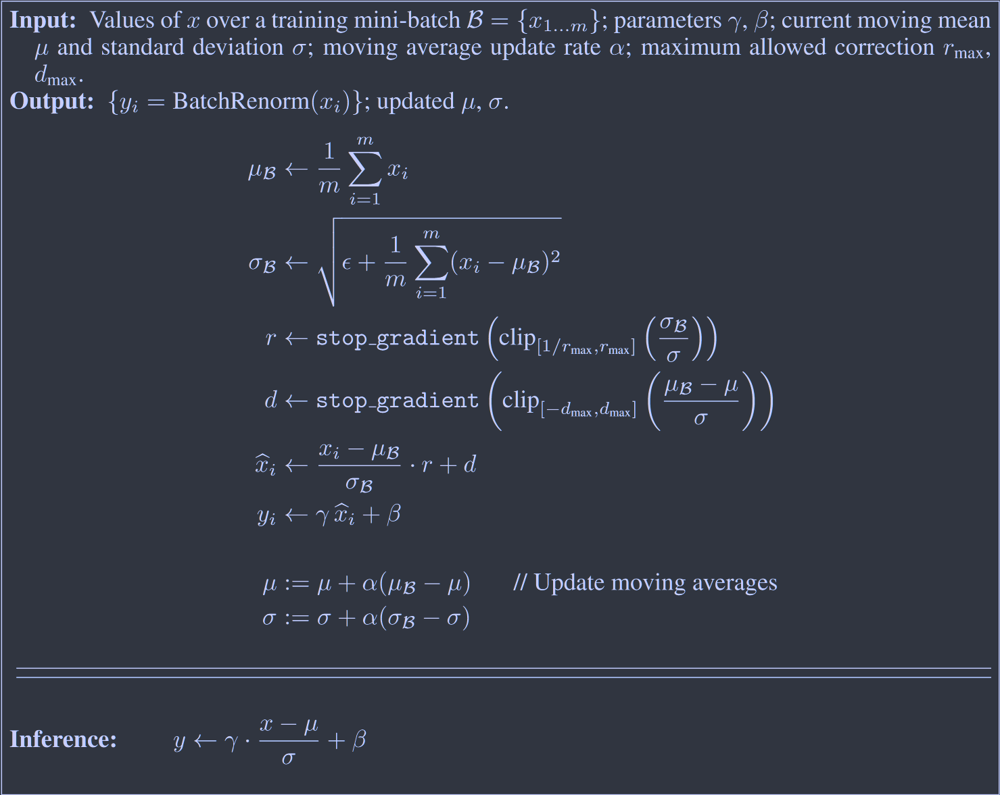

# Batch Renormalization: Towards Reducing Mini-Batch Dependence in Batch-Normalized Models

[NeurIPS 2017](https://proceedings.neurips.cc/paper/2017/hash/c54e7837e0cd0ced286cb5995327d1ab-Abstract.html)	no code 

批量化虽然有效，但不太适合小型或非独立同分布的minibatch，我们认为是由于模型中的这些激活在训练和推理阶段计算方式不同导致的。这项工作改进了BatchNorm层，不在直接使用小批量内数据的均值方差来进行归一化操作，而是引入一个通过小批量统计量累计计算的总体统计量，来纠正小批量与总体统计量之间的差异。

## Introduction 

批量归一化有助于在模型训练时稳定内部激活的分布，还可以使用更高的学习率并降低初始化的敏感性。

与输入样本对应的BN激活取决于小批量中的其他样本，而这在推理时是不可取的，因此可以使用在训练数据上计算的均值和方差，虽然这是有意义的，但这回改变网络中的激活，这意味着训练时的表示（使用小批量的归一化参数）与推理时的表示（使用总体统计量的归一化参数）不同。若小批量很大且元素是来自分布的独立同分布样本时这种差异很小，但这也有缺点：

对于小批量，均值和方差的估计值会变得不准确，这些不准确性会随着深度的增加而加剧。

非独立同分布，小批量可能会对具有BN层的模型产生不利影响，可能会导致模型过度拟合到小批量的特定分布，并在应用打单实例时受到影响。

## Prior Work: Batch Normalization

$$
\Theta = \arg \mathop{min}\limits_{\Theta} \frac{1}{N}\sum^N_{i=1}\mathcal{l_i}(\Theta)
$$

$li$是第i个训练样本的损失，$\Theta$是模型权重的向量，在每个训练步骤使用一小批量m个示例来计算梯度：
$$
\frac{1}{m}\frac{\partial l_i(\Theta)}{\partial\Theta}
$$
批量归一化考虑小批量$\mathcal{B}={x_{1...m}}$:
$$
\mu_{\mathcal{B}} \leftarrow \frac{1}{m} \sum^m_{i=1}x_i \\
\sigma_{\mathcal{B}} \leftarrow \sqrt{\frac{1}{m}\sum^m_{i=1}(x_i-\mu_{\mathcal{B}})^2+\epsilon} \\
\hat{x_i} \leftarrow \frac{x_i-\mu_{\mathcal{B}}}{\sigma_{\mathcal{B}}} \\
y_i = \gamma \hat{x_i} + \beta \equiv BN(x_i)
$$
$\gamma, \beta$为可训练参数

## Method

使用BatchNorm，网络中的活动在训练和推理之间有所不同，因为两个模型之间的规范化方式不同，这里我们目标是纠正这一点并保留BN的好处。

设$\mu,\sigma$是x均值和标准差的估计值，可以计算最近几个小批量的移动均值，有：
$$
\frac{x_i-\mu}{\sigma} = \frac{x_i-\mu_\mathcal{B}}{\sigma_{\mathcal{B}}}·r+d, \ where\ r=\frac{\sigma_{\mathcal{B}}}{\sigma},d=\frac{\mu_{\mathcal{B}}-\mu}{\sigma}
$$
若$\sigma = E[\sigma_{\mathcal{B}}],\mu=E[\mu_{\mathcal{B}}]$，则有$E[r]=1,E[d]=0$，而在BN中其实是简单的设置r=1，d=0

我们将此仿射变换的参数r和d视为固定的，即使他们是从小批量本身计算得出的，r和d纠正了小批量统计量与总体统计量的不同，与BN中可训练的$\gamma,\beta$不同，r和d不是通过梯度下降来训练的，并且在小批量之间有所不同，因为他们依赖于当前小批量的统计数据。

批量化虽然有效，但不太适合小型或非独立同分布的minibatch，我们认为是由于模型中的这些激活在训练和推理阶段计算方式不同导致的。

### Discussion 

**test on small mini-batches and Non-i.i.d. mini-batches**

