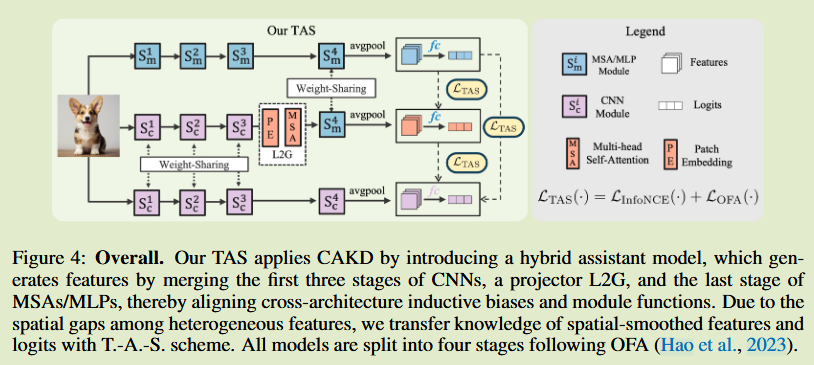
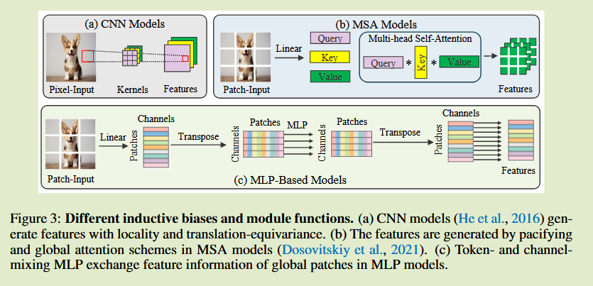

# TAS: Distilling Arbitrary Teacher And Student Via A Hybrid Assistant

2024 arXiv	no code	CIFAR ImageNet	20250110

对于OFA的改进，OFA仅考虑logit空间没有考虑中间特征，是次优的结果，引入一个L2G层对齐CNN和MLP/MSA，提出均方误差不适合异构架构的蒸馏之间的特征转移，引入对比损失InfoNCE

## Introduction 

跨架构蒸馏CAKD面临的主要挑战在于异质模型之间的特征差异，源于其固有的归纳偏差和模型功能的差异，我们提出引入辅助模型作为桥梁来促进异构师生模型之间的特征传递。

同质蒸馏有两个局限性：

- 有限的潜力：与更广泛的教师模型（包括同质和异质）相比，SAKD教师的有限范围可能无法包括某学学生所需的最优知识；OFA证明了从异构ViT教师抽取知识到ResNet50要优于从ResNet152抽取。
- 有限的灵活性：新模式以及特定领域中缺乏完美匹配的同质模型，阻碍了同质蒸馏的发展

跨架构蒸馏的挑战：

- 跨架构模型特征存在显著差异，主要由于归纳偏差和模块功能(模型如何读取 解码 处理输入)本身的差异
- CNN的表现出硬归纳偏差，表现为局部性和平移等变性
- 多头注意力和多层感知器模型表现出软归纳偏差，表现出长距离依赖

先前方法通过映射到logit空间来解决异构特征差距，会给特征带来实质性的损害，是次优的。我们希望得到不同归纳偏差和功能模块的最佳利用，来减少异构表示差距。

我们提出混合助理模型来促进知识转移。

## Method

归纳偏差：模型用于对未知数据做出预测的一组假设

模块功能：描述了模型如何对数据进行读取、编码、解码和处理

不同模型表现出不同的归纳偏差和模块功能

- CNN模型在像素级图像上滑动一组可学习的局部核，专注于局部感受野，权重共享应用与整个图像，为整个图像提供了平移等变形，能够识别任何位置的物体
- MSA模型将输入图像分割成图像块，然后将图像块投影到QKV中，注意力模块计算QK之间的得分来生成注意力图，利用该注意力图加权相应的，捕获了长距离的依赖关系，使模型能够考虑所有图像块的全局信息
- MLP模型是对输入图像进行分块，混合了所有图像块的空间和通道维度信息

**不同的归纳偏差和模块函数决定了生成特征的不同分布**

#### 三级蒸馏范式

为了缩小师生模型之间的信息差距，引入一个辅助模型作为中间桥梁，训练一个教师-助教-学生的框架TAS：
$$
L = L_{TAS}(K_t, K_s) + L_{TAS}(K_t, K_a) + L_{TAS}(K_a, K_s)
$$

##### 辅助模型

通过局部到全局的特征投影连接学生的CNN模块和教师的MSA模块，辅助模型可以描述为：
$$
p_a(x) = fc_m \circ S^4_m \circ (MSA \circ PE) \circ S^3_c \circ S^2_c \circ S^1_c(x)
$$
$fc_m, S_m, S_c$分别表示MSA/MLP全连接层、MSA/MLP层、CNN层，我们提出一个L2G模块连接CNN 和MSA/MLP层，包括一个图像块嵌入层和一个MSA模块，整个辅助模型中，L2G是唯一一个可学习的模块

##### 损失设计

- MSE适用于相似空间的信息特征计算，当空间特征差异很大时，MSE将失效，我们使用一个对比损失InfoNCE来特征的结构信息
- 不同归纳偏差的模型会导致不同的logit空间，我们继续沿用OFA模型的损失

$$
L_{TAS}(K_t, K_s) =
\begin{cases}
\begin{aligned}
&L_{OFA}(p_t, p_s) = (1+p_t^{\hat{c}})^\gamma \ log\frac{p_t^{\hat{c}}}{p_s^{\hat{c}}} + \sum^C_{i=1,i\neq\hat{c}}p^c_t \ log\frac{p^c_t}{p^c_s} \\
&L_{InfoNCE}(f_t, f_s) = -log \frac{exp(f_s·f_t^+/\tau_2)}{\sum^{F_i}_{i=0}exp(f_s·f_t^i/\tau_2)}
\end{aligned}
\end{cases}
$$

