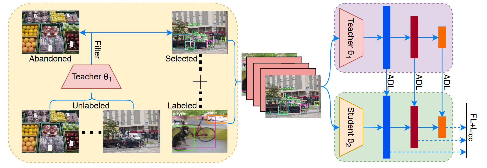

# Learning Efficient Detector with Semi-supervised Adaptive Distillation

**[arXiv 2019](https://arxiv.org/abs/1901.00366)	[code in github](https://github.com/Tangshitao/Semi-supervised-Adaptive-Distillation)	Object Detection Semi-supervised CoCo**

*Shitao Tang, Litong Feng, Wenqi Shao, Zhanghui Kuang, Wei Zhang, Yimin Chen*

本文针对半监督目标检测中难以学习的样本和难以模仿的样本提出了自适应的蒸馏损失，并提出一种简单的过滤机制来筛选未标记的数据，从而使之能够高效的向学生模型传递知识。

## Introduction 

与2-stage检测器相比，1-stage由于设置了密集的锚点，需要处理更多的样本，简单样本和困难样本之间的不平衡是一个挑战。在蒸馏过程中有两类样本很重要：学生预测与教师预测差距较大的难以模仿的样本（hard-to-mimic）；教师预测不确定度较大的难以学习的样本（hard-to-learn）。我们提出一种自适应蒸馏知识损失ADL，更加关注教师定义的困难样本，并在蒸馏中自适应调整容易学和不易学之间的蒸馏权重。

我们还提出了一种简单的过滤机制来解决未标记数据的有效知识传递。

## Method

### Adaptive Distillation 

焦点损失Focal Loss:
$$
FL(p_t)=-(1-p_t)^\gamma log(p_t) \\
p_t = 
\begin{cases}
p, {\kern 28pt}  if\ y=1\\
1-p, {\kern 10pt} otherwise  \\
\end{cases}
$$

$y\in \{\pm1\}$表示真实标签，$p\in[0,1]$为模型针对标签为y=1的预测概率。通过FL可以减轻易分样本的损失贡献，增加难分样本的损失比例，当pt趋向于1时，说明样本是易分类的，$(1-p_t)^\gamma$趋向于0，减轻了易分类样本的损失比例

对于以下情况，我们将q表示为教师预测的软概率值，将p表示为学生预测的软概率值，知识蒸馏测量两个分布之间的相似性：
$$
KL(T||S) = qlog(\frac{q}{p})+(1-q)log(\frac{1-q}{1-p})
$$
本文剩余部分记$KL=KL(S||T)$

#### Focal Distillation Loss

采用焦点损失进行知识蒸馏的常见方法是将KL乘以焦点项，分类损失与KL的联合损失定义为：
$$
L=FP(p)(-log(p_t)+KL) \\
FT(p) = (1-p_t)^\gamma
$$
因此焦点蒸馏损失:
$$
FDL = (1-p_t)^\gamma KL
$$

#### Adaptive Distillation Loss

然而FDL由FL主导，KL对总体的贡献很少，为了解决这个问题，我们假设单阶段目标检测器上的KD应专注于测量学生与教师之间的输出概率分布距离，因此应使用0-1之间的调节因子来自适应的学习特征，受前启发我们提出DW(Distillation Weight)：
$$
DW=(1-e^{-KL})^\gamma
$$
正如焦点损失一样，$\gamma$控制简单样本权重衰减速率，$(1-e^{-KL})$控制每个样本的权重大小，但是DW仅在训练过程中调整学生和教师之间的权重，由于难以学习的样本在蒸馏中极其重要，我们提出了ADW来调整难以学习样本的整体权重百分比PHLS：、
$$
ADW = (1-e^{-(KL+\beta T(q))})^\gamma \\
T(q) = -(qlog(q)+(1-q)log(1-q))
$$
T(q)是教师的熵，当q为0.5时达到最大值，q接近0或1时达到最小值，教师概率q反应了对分类的不确定性，当q接近0.5时，相应样本被视为难以学习(hard-to-learn)的样本，具有高KL值的样本被视为难以模拟(hard-to-mimic)的样本，当$\beta$变大时，PHLS会增加，因此KL控制训练过程中难以模仿的样本权重，而T(q)控制教师最初定义的难以学习的样本的权重，他们组合可以自适应的调整蒸馏权重，自适应蒸馏损失定义为：
$$
ADL=ADW·KL=(1-e^{-(KL+\beta T(q))})^\gamma· KL
$$
当ADL被原始焦点损失的归一化器归一化时，训练是不稳定的，因为模仿教师模型预测的负样本的软标签也有助于ADL，另外在半监督环境中，未标记数据的阳性样本数量是未知的，为了使KD训练更加稳定，定义归一化器为：
$$
N = \sum^n_iq^\theta_i
$$
N是由$\theta$驱动的正样本在所有锚点熵的概率之和，调节因子$\theta$减少了负样本的权重贡献，$\theta$根据经验设置为1.8

#### Loss for Distilling Student Model 

学生模型的训练损失：
$$
L = FL+ADL+L_{loc}
$$
FL是原始的焦点损失，$L_{loc}$为bbox损失，ADL是我们提出的自适应蒸馏损失。

### Semi-supervised Adaptive Distillation Scheme

仅靠ADL提高转移效率很难弥合师生模型之间的差异，我们试图有效挖掘数据来进一步提升蒸馏性能。

**Generating Labels on Unlabeled Data**

非极大值抑制过滤掉的困难样本对知识转移具有重要意义，因此我们建议硬标签和软标签的组合：

> 使用标记数据训练教师模型
>
> 使用教师模型为未标记的数据生成硬标签
>
> 使用标记和未标记的数据的硬标签和软标签同时训练学生模型

**Unlabeled Data Selection**

未标记的数据和标记数据通常不在同一个分布中，收集不同类型的数据用于不同的目的，利用所有可用数据来蒸馏学生是低效的，对于从不同来源收集的未标记数据大多数不包含任何注释，因此很容易被训练有素的教师模型归类未负样本，相反至少包含一个正样本的图像通常更难以检测，基于这些我们选择那些由教师产生了至少一个注释的图像，以更有效的传递知识蒸馏学生模型
