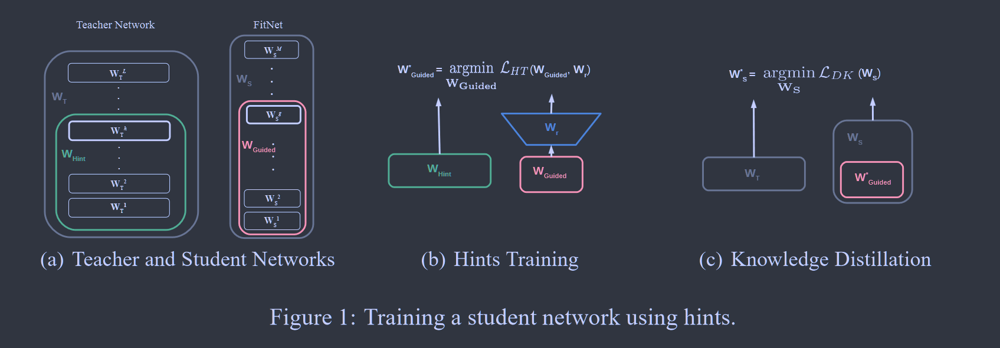
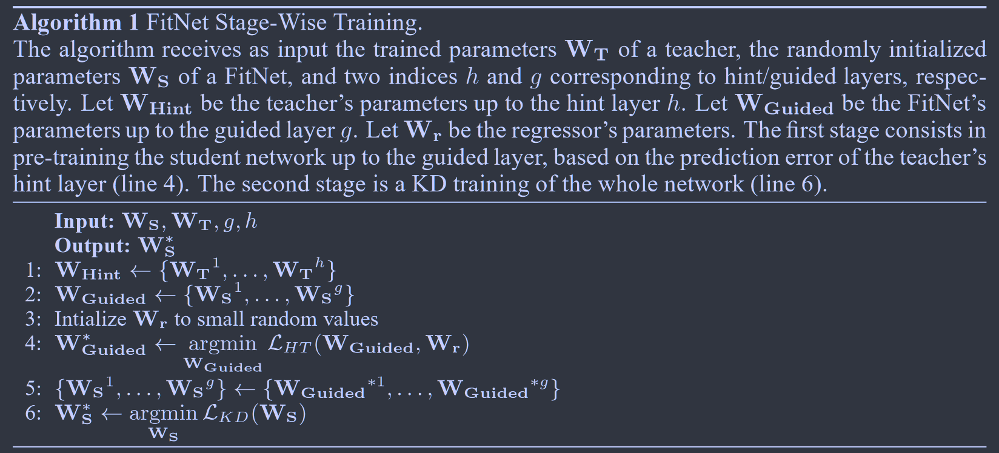

# FitNets: Hints For Thin Deep Nets

**[ICLR 2015](https://arxiv.org/abs/1412.6550)	[code in github](https://github.com/adri-romsor/FitNets)	CIFAR10/100  SVHN  MNIST  AFLW**	

**不直接对齐师生模型的特征图，而是训练一个比教师网络更深但更细的网络来进行模型压缩，因为有研究表明更深的网络的表达能力要比更浅的网络高指数倍，只需要合适的训练方式。**

## Introduction

现用的工作都集中于将教师网络或网络集合压缩为宽度深度相似的网络和更浅更宽的网络而没有利用深度。有研究表明，深层表示表达能力比浅层要高指数倍

因此这项工作旨在通过深度的优势解决模型压缩问题，我们训练一个瘦而深的网络。

**对于NST(2017)提出的为什么不直接对齐教师和学生的特征图，我认为就是在这个地方，更深的网络表达能力要更强而宽度并不是必须的。**

## Method

我们选择教师网络中某个隐藏层的输出作为提示层，选择学生网络中的某个层作为引导层，引导层从教师的提示层进行学习。

提示层其实相当于一种正则化的形式，为了使网络不过正则化，我们应该选择合适的提示/引导层，我们设置的引导层越深，我们赋予网络的灵活性就越小，FetNets很容易受到过度正则化的影响

### 训练过程

#### Stage 1

利用教师的提示层训练学生的引导层，根据HT损失来进行优化：
$$
\mathcal{L}(W_{Guided}, W_r) = \frac{1}{2}||u_h(x;W_{Hint}) - r(v_g(x;W_{Guided});W_r)||^2
$$
$W_{Guided}$，$W_r$分别表示学生/教师模型中引导/提示层的参数，$W_r$表示回归层的参数，用于对齐提示层和引导层的大小

#### Stage 2

对整个网络利用KD损失进行训练：
$$
\mathcal{L}_{KD} = \mathcal{H}(y_{true}, P_S) + \lambda\mathcal{H}(P_T^\tau, P_S^\tau)
$$
教师会根据自己的置信度对样本进行惩罚，$\lambda$控制教师模型交叉熵的权重，为了促进教师置信度较低的样本学习，在训练过程中将$\lambda$逐步线性衰减，才促进复杂样本的学习。