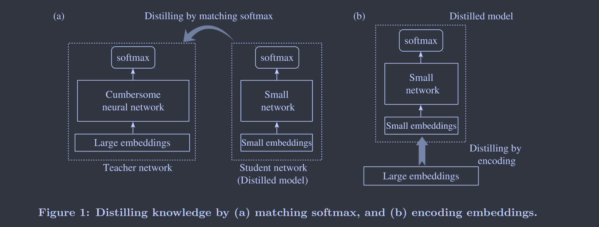

# Distilling Word Embeddings: An Encoding Approach

[2016CIKM CCF-B](https://dl.acm.org/doi/abs/10.1145/2983323.2983888)	**no code**

**本文提出一个词嵌入的蒸馏，证明了小型嵌入会丢失句法的某些信息而使用蒸馏嵌入则会保留下来这部分信息，思想比较简单最后的可行性分析值得思考与借鉴。**

## 	Introduction

一个词首先被表示为一个one-hot向量，将其乘以一个大的嵌入矩阵(查找表)，以映射到词的输出表示，而查找表中仅有一列是针对当前单词的，因此我们可以构建一个夹在高维嵌入和之后网络中间的夹层，利用高维嵌入知识蒸馏到低维嵌入。

> 我们解决了在NLP应用中蒸馏词嵌入的问题
>
> 我们提出了一种监督编码放大，从复杂的词嵌入中提炼出特定的任务知识
>
> 我们在情感分析和关系分类任务的实验中揭示了一种现象，即从大嵌入中蒸馏低维嵌入比直接训练小嵌入更好

## Method

左图为传统的蒸馏方法，右图是我们提出的词嵌入蒸馏方法，蒸馏嵌入表示如下：（eq1）

$x_i\in\mathbb{R}^{|V|}$表示词的onehot表示，$\Phi_c\in\mathbb{R}^{n_{embed}\times|V|}$表示大的词嵌入，$W_{encode}\in\mathbb{R}^{n_{distill}\times n_{embed}}$，$b_{encode}\in \mathbb{R}^{n_{distill}}$为编码层参数

采用标准交叉熵训练该encoder：

$y_i^{j},t_i^{j}$分别表示网络输出和gt标签

## Discussion

### Theorem 1

**具有蒸馏嵌入的神经网络模型容量小于或等于直接使用小嵌入的神经网络的模型容量**

小嵌入是不受约束的自由参数，而蒸馏嵌入要收到eq1的约束

**一个奇怪的问题：为什么直接使用小嵌入网络性能不如蒸馏嵌入？**

我们认为词嵌入是以无监督的方式从大型语料库中学习的，受到知识维度的限制，例如一个词的情感信息相对于句法功能信息相比在一个小的嵌入中可能会被忽略，而从一个较大嵌入中蒸馏成小的嵌入这部分信息能很好的保留下来。