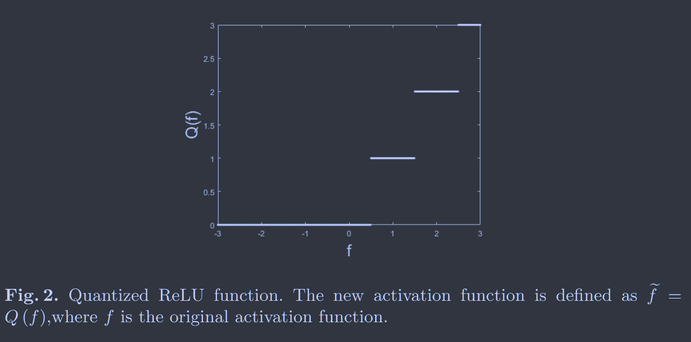
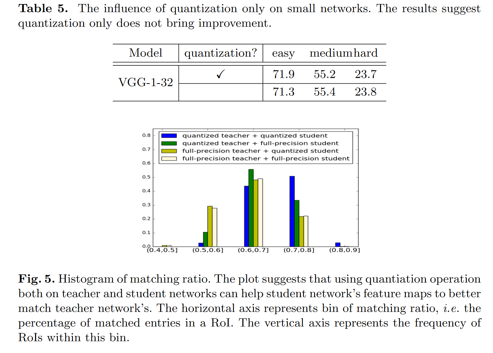

# Quantization Mimic: Towards Very Tiny CNN for Object Detection

[ECCV2018](https://openaccess.thecvf.com/content_ECCV_2018/html/Yi_Wei_Quantization_Mimic_Towards_ECCV_2018_paper.html)	**no code**

将量化方法和蒸馏方法相结合提出了一种新的量化蒸馏框架，训练一个全精度教师网络，将其压缩为量化网络，提出一种模仿损失，让学生网络量化后的特征图模拟教师网络量化后的特征图

## Introduction

一个自然的假设是：如果我们使用量化的方法离散化教师模型的特征图，学生网络搜索范围将会缩小，且更容易迁移知识；对学生网络进行量化可以提高教师网络离散特征图的匹配率。

> 我们提出一种有效的算法来训练非常小的网络，据我们所知，这是第一个关注非常小网络的工作
>
> 我们利用量化特征图来促进知识蒸馏
>
> 我们使用复杂的任务对象检测而不是图像检测来验证我们的方法，对于各种CNN框架和数据集充分实验验证我们方法的有效性
>
> 该方法易于实现，在训练和推理过程没有特殊限制

## Method

我们将量化方法和蒸馏方法结合起来并提出了新的量化蒸馏框架

### Quantization 

有的工作通过量化方法直接压缩模型，而我们使用量化来限制范围来帮助蒸馏的学习。教师网络的量化就是对齐输出进行离散化，同时保证教师网络在量化时的准确性，量化学生网络可以帮助其匹配教师网络。

我们使用均匀量化，量化公式定义为：

量化的ReLU函数如下所示：

对于反向传播，我们使用全精度梯度来进行，因为有的工作表明使用量化梯度会导致学生网络难以收敛。

### Mimic

我们使用L2回归来让学生网络从教师网络中学习特征图。在目标检测任务中，我们在学生和教师模型特征图之间的兴趣区域上使用蒸馏学习：

其中$L_{cls}^r$ $L_{reg}^r$是区域提议网络的损失函数，$L_{cls}^d$ $L_{reg}^d$是R-FCN或Faster R-CNN的检测器的损失函数，$L_m$是模拟损失，$\lambda$为损失权重，N为区域提案数量，$f_t^i$ $f_s^i$分别表示学生和教师网络特征图上第i个区域提案，函数r(·)将特征图从学生网络与教师网络特征图对齐。

尽管RoI模仿学习减少了特征图的维度并有助于学生网络的收敛，但非常小的网络对模仿损失的权重$\lambda$很敏感，如果$\lambda$太小会削弱模仿学习的有效性，而较大的$\lambda$会导致其在训练开始就专注于教师网络特征图的学习而忽略其他损失，这种现象称之为***梯度聚焦***。

### Quantization Mimic

我们提出的算法流程如下：首先训练一个全精度的教师网络，使用函数Q将其压缩为量化网络，我们利用量化的教师网络来使用模仿损失作为监督来指导学生网络学习，其中学生网络的特征图也进行量化。模拟损失如下：

## Discussion

对于量化操作，我们注意到量化操作具有正则化的作用，我们实验发现仅进行量化对性能没有影响，也就是说对于量化带来的性能提升是来自于Quantization Mimic，实验表明量化操作可以提高RoI的匹配率来促进特征图的匹配过程。

我们还对不同的量化方法进行了研究，我们使用均匀量化，另一种流行的量化方法是2的幂量化，实验表明均匀量化要比2的幂量化好得多，这可能是由于模仿学习基于RoI，这些领域的强烈反应十分重要，均匀量化方法能更准确的描述大数，而2的幂量化对小数描述更准确。

我们还对梯度聚焦现象进行了研究：权重太小模仿学习的有效性会下降，而权重设置的太大会忽略其他损失

