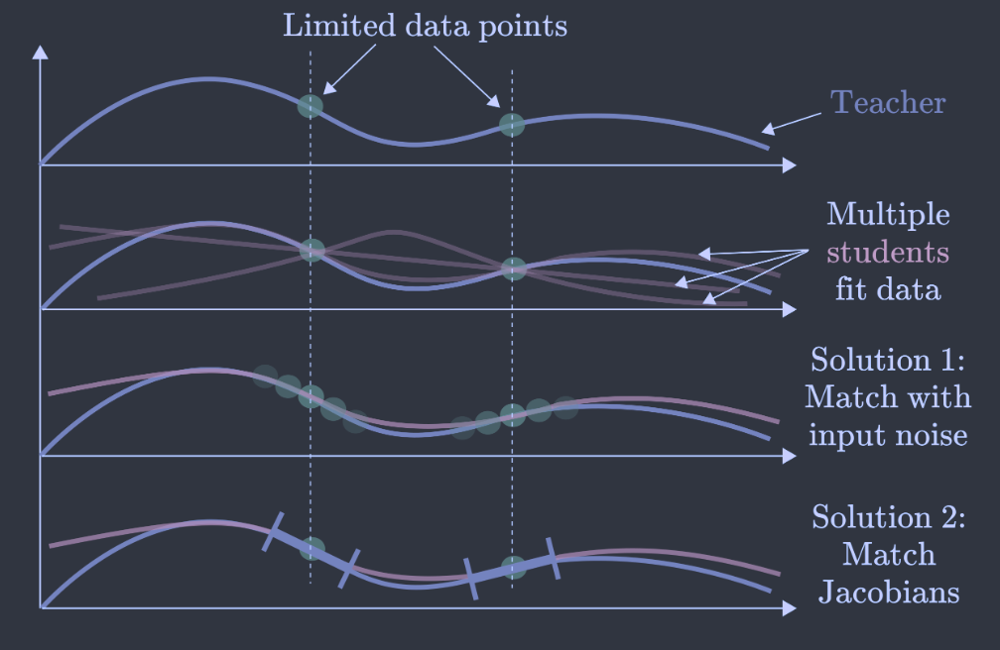

# Local Affine Approximations for Improving Knowledge Transfer

Idiap 2018 ?	Suraj Srinivas   Franc ̧ois Fleuret  

# Knowledge Transfer with Jacobian Matching

PMLR 2018	Suraj Srinivas   Franc ̧ois Fleuret

本文提出了通过雅可比矩阵的匹配来进行师生模型之间的知识转移，本文认为两个网络的雅可比矩阵匹配等价于在训练过程中对输入添加噪声的软标签进行匹配，通过泰勒公式对神经网络进行仿射逼近，验证了这一观点。 我给出了完整的证明过程。

## Introduction 

一个完善的知识迁移方法将使我们能够无缝地将一个神经网络结构转换为另一个神经网络结构，同时保持输入-输出映射和泛化。本文通过神经网络的一阶近似来处理知识转移问题，先前的工作考虑了雅可比矩阵匹配的思想，但对雅可比矩阵施加什么样的惩罚是不明确的，本文来解决这一问题。

> 证明了匹配雅可比是蒸馏的一个特例，其中我们的方法噪声被添加到输入中
>
> 使用正则化器，提高了知识转移的性能
>
> 使用雅可比惩罚训练神经网络可以提高噪声的稳定性

## Method & Theoretical Proofs

根据一阶泰勒公式，对函数$f:\mathbb{R}^D \rightarrow \mathbb{R}$，在一个邻域内$\{ x+\Delta x:||\Delta x||\le \epsilon \}$：
$$
f(x+\Delta x)=f(x) + \nabla_xf(x)^T(\Delta x) + \mathcal{O}(\epsilon) \approx f(x) + \nabla_xf(x)^T(\Delta x)
$$
这是函数f(·)在局部邻域内的局部仿射近似，这种近似对于分析神经网络这样的非线性对象是有效的。要构造整个神经网络的仿射逼近，必须构造网络中所有这些非线性项的仿射逼近，而神经网络的非线性性通常来源于ReLU等非线性激活函数。

给定问题：

***在一个数据集$\mathcal{D}$上训练教师网络$\mathcal{T}$，用$\mathcal{T}$的提示来增强学生网络$\mathcal{S}$在$\mathcal{D}$上的训练。***

我们认为**两个网络的雅可比矩阵匹配等价于在训练过程中对输入添加噪声的软标签进行匹配。**

### Proposition 1.

考虑两个k维度（$\in \mathbb{R}^k$）的神经网络软标签的平方损失误差：$\mathcal{l}(\mathcal{T}(x), \mathcal{S}(x)) = \sum^k_{i=1}(\mathcal{T}^i(x) - \mathcal{S}^i(x))$，$x\in \mathbb{R}^D$为输入数据，令$\xi(\in \mathbb{R}^D) = \sigma z$为缩放系数为$\sigma\in\mathbb{R}$的标准正态分布随机变量，因此有以下成立：
$$
\mathbb{E}_{\xi}[\sum^k_{i=1}(\mathcal{T}^i(x+\xi) - \mathcal{S}^i(x+\xi))^2] = \sum_{i=1}^k(\mathcal{T}^i(x)-\mathcal{S}^i(x))^2 + \sigma^2\sum^k_{i=1}||\nabla_x\mathcal{T}^i(x)-\nabla_x\mathcal{S}^i(x)||^2_2 + \mathcal{O}(\sigma^4)
$$
该式子将损失分解为两部分，一个代表样本上的蒸馏损失，另一项代表雅可比匹配损失，当$\sigma$较小时，最终误差项很小可以忽略。

这种推论也能推广到交叉熵误差上：
$$
\mathbb{E}_{\xi}[-\sum^k_{i=1}\mathcal{T}^i_s(x+\xi)log(\mathcal{S}^i_s(x+\xi))] \approx -\sum_{i=1}^k\mathcal{T}^i_s(x)log(\mathcal{S}^i_s(x)) - \sigma^2\sum^k_{i=1}\frac{\nabla_x\mathcal{T}^i_s(x)^T \nabla_x\mathcal{S}^i_s(x)}{\mathcal{S}^i_s(x)}
$$

#### Proofs 1.

对$\mathcal{T}(x+\xi),\mathcal{S}(x+\xi)$做一阶泰勒展开，代入有：
$$
\mathbb{E}_{\xi}[\sum^k_{i=1}(\mathcal{T}^i(x+\xi) - \mathcal{S}^i(x+\xi))^2] = \mathbb{E}_{\xi}[\sum^k_{i=1}(\mathcal{T}^i(x) + \xi\nabla_x\mathcal{T}^i(x) - \mathcal{S}^i(x) - \xi\nabla_x\mathcal{S}^i(x))^2] + \mathcal{O}(\sigma^4) \\
= \mathbb{E}_{\xi}[\sum^k_{i=1}(\mathcal{T}^i(x) - \mathcal{S}^i(x))^2 + \sum^k_{i=1}\xi^2(\nabla_x\mathcal{T}^i(x)  - \nabla_x\mathcal{S}^i(x))^2 + \sum^k_{i=1}(2\xi ( \mathcal{T}^i(x) - \mathcal{S}^i(x) )( \nabla_x\mathcal{T}^i(x)  - \nabla_x\mathcal{S}^i(x) )
] + \mathcal{O}(\sigma^4) \\
= \mathbb{E}_{\xi}[\sum^k_{i=1}(\mathcal{T}^i(x) - \mathcal{S}^i(x))^2] + \mathbb{E}_{\xi}[\sum^k_{i=1}\xi^2(\nabla_x\mathcal{T}^i(x)  - \nabla_x\mathcal{S}^i(x))^2] + \mathbb{E}_{\xi}[\sum^k_{i=1}(2\xi ( \mathcal{T}^i(x) - \mathcal{S}^i(x) )( \nabla_x\mathcal{T}^i(x)  - \nabla_x\mathcal{S}^i(x) )] + \mathcal{O}(\sigma^4) \\
= \sum_{i=1}^k(\mathcal{T}^i(x)-\mathcal{S}^i(x))^2 + \sigma^2\sum^k_{i=1}||\nabla_x\mathcal{T}^i(x)-\nabla_x\mathcal{S}^i(x)||^2_2 + \mathcal{O}(\sigma^4)
$$
$\xi = \sigma z$，z为标准正态分布，因此有$\mathbb{E}_{\xi}[\xi]=0,\mathbb{E}_{\xi}[\xi^2]=\sigma^2$.

对交叉熵损失，$\mathcal{T}(x+\xi),\mathcal{S}(x+\xi)$做一阶泰勒展开，代入有：

$$
\mathbb{E}_{\xi}[-\sum^k_{i=1}\mathcal{T}^i_s(x+\xi)log(\mathcal{S}^i_s(x+\xi))] \\
= \mathbb{E}_{\xi}[-\sum^k_{i=1} (\mathcal{T}^i_s(x) + \xi\nabla_x\mathcal{T}^i_s(x)) log(\mathcal{S}^i_s(x)+\xi\nabla_x\mathcal{S}^i_s(x))]
$$

对$log(\mathcal{S}^i_s(x)+\xi\nabla_x\mathcal{S}^i_s(x))$做二阶泰勒展开有：

$$
log(\mathcal{S}^i_s(x)+\xi\nabla_x\mathcal{S}^i_s(x)) \approx log[\mathcal{S}^i_s(x)] + \frac{\xi\nabla_x\mathcal{S}^i_s(x)}{\mathcal{S}^i_s(x)} - \frac{1}{2}\frac{\xi^2\nabla^2_x\mathcal{S}^i_s(x)}{[\mathcal{S}^i_s(x)]^2}
$$

代入有：

$$
\approx \mathbb{E}_{\xi}[-\sum^k_{i=1} (\mathcal{T}^i_s(x) + \xi\nabla_x\mathcal{T}^i_s(x)) (log\mathcal{S}^i_s(x)+\frac{\xi\nabla_x\mathcal{S}^i_s(x)}{\mathcal{S}^i_s(x)}-\frac{1}{2}\frac{\xi^2\nabla^2_x\mathcal{S}^i_s(x)}{[\mathcal{S}^i_s(x)]^2})] \\
=\mathbb{E}_{\xi}[-\sum^k_{i=1} [(\mathcal{T}^i_s(x) log\mathcal{S}^i_s(x)) (\xi \mathcal{T}^i_s(x) \frac{\nabla_x\mathcal{S}^i_s(x)}{\mathcal{S}^i_s(x)}) (-\frac{\xi^2}{2}\mathcal{T}^i_s(x) \frac{\nabla^2_x\mathcal{S}^i_s(x)}{[\mathcal{S}^i_s(x)]^2})(\xi\nabla_x\mathcal{T}^i_s(x) log\mathcal{S}^i_s(x)) (\xi^2 \nabla_x\mathcal{T}^i_s(x) \frac{\nabla_x\mathcal{S}^i_s(x)}{\mathcal{S}^i_s(x)}) (-\frac{\xi^3}{2}\nabla_x\mathcal{T}^i_s(x) \frac{\nabla^2_x\mathcal{S}^i_s(x)}{[\mathcal{S}^i_s(x)]^2}))]] \\
= -\mathbb{E}_{\xi}[\sum^k_{i=1}(\mathcal{T}^i_s(x) log\mathcal{S}^i_s(x)) ] - \mathbb{E}_{\xi}[\xi \sum^k_{i=1}(\mathcal{T}^i_s(x) \frac{\nabla_x\mathcal{S}^i_s(x)}{\mathcal{S}^i_s(x)}) ] + \mathbb{E}_{\xi}[\frac{\xi^2}{2} \sum^k_{i=1}(\mathcal{T}^i_s(x) \frac{\nabla^2_x\mathcal{S}^i_s(x)}{[\mathcal{S}^i_s(x)]^2})] \\ - \mathbb{E}_{\xi}[\xi\sum^k_{i=1}(\nabla_x\mathcal{T}^i_s(x) log\mathcal{S}^i_s(x))] - \mathbb{E}_{\xi}[\xi^2\sum^k_{i=1}( \nabla_x\mathcal{T}^i_s(x) \frac{\nabla_x\mathcal{S}^i_s(x)}{\mathcal{S}^i_s(x)})] + \mathbb{E}_{\xi}[\frac{\xi^3}{2}\sum^k_{i=1}(\nabla_x\mathcal{T}^i_s(x) \frac{\nabla^2_x\mathcal{S}^i_s(x)}{[\mathcal{S}^i_s(x)]^2}))] \\
= -\sum_{i=1}^k\mathcal{T}^i_s(x)log(\mathcal{S}^i_s(x)) - \sigma^2\sum^k_{i=1}\frac{\nabla_x\mathcal{T}^i_s(x)^T \nabla_x\mathcal{S}^i_s(x)}{\mathcal{S}^i_s(x)}
$$

$\xi = \sigma z$，z为标准正态分布，因此有:

$$
\mathbb{E}_{\xi}[\xi^p]=
\begin{cases}
0,\ p\ is\ odd\\
\sigma^p,\ p\ is\ even
\end{cases}
$$

原式：

$$
= -\mathbb{E}_{\xi}[\sum^k_{i=1}(\mathcal{T}^i_s(x) log\mathcal{S}^i_s(x)) ]+ \mathbb{E}_{\xi}[\frac{\xi^2}{2} \sum^k_{i=1}(\mathcal{T}^i_s(x) \frac{\nabla^2_x\mathcal{S}^i_s(x)}{[\mathcal{S}^i_s(x)]^2} )] - \mathbb{E}_{\xi}[\xi^2\sum^k_{i=1}( \nabla_x\mathcal{T}^i_s(x) \frac{\nabla_x\mathcal{S}^i_s(x)}{\mathcal{S}^i_s(x)})]\\
= -\sum_{i=1}^k\mathcal{T}^i_s(x)log(\mathcal{S}^i_s(x)) - \sigma^2\sum^k_{i=1}\frac{\nabla_x\mathcal{T}^i_s(x)^T \nabla_x\mathcal{S}^i_s(x)}{\mathcal{S}^i_s(x)}
$$
最后这里为了方便起见我们忽略掉超线性误差，得证。

### Proposition 2

考虑训练一个具有k个标签神经网络的平方误差代价函数$\mathcal{l}(y(x), \mathcal{S}(x))=\sum^k_{i=1}(y^i(x)-\mathcal{S}^i(x))^2$，$x\in\mathbb{R}^D$是输入数据，$y^i(x)$是类别i的标签，令$\xi(\in \mathbb{R}^D) = \sigma z$为缩放系数为$\sigma\in\mathbb{R}$的标准正态分布随机变量，因此有以下成立：

$$
\mathbb{E}_{\xi}[\sum^k_{i=1}(y^i(x) - \mathcal{S}^i(x+\xi))^2] = \sum_{i=1}^k(y^i(x)-\mathcal{S}^i(x))^2 + \sigma^2\sum^k_{i=1}||\nabla_x\mathcal{S}^i(x)||^2_2 + \mathcal{O}(\sigma^4)
$$
这正是标准的样本损失+正则化项的形式，同样结果表明以一个更适合的扩展是对于雅可比范数的惩罚而不是直接对权重进行惩罚。

对于交叉熵的情况：
$$
\mathbb{E}_{\xi}[-\sum^k_{i=1}y^i(x)log(\mathcal{S}^i_s(x+\xi))] \approx - \sum_{i=1}^ky^i(x)log(\mathcal{S}^i_s(x)) + \sigma^2\sum^k_{i=1}y^i(x)\frac{||\nabla_x\mathcal{S}^i_s(x)||^2_2}{\mathcal{S}^i_s(x)^2}
$$

#### Proofs 2.

对$\mathcal{S}(x+\xi)$做一阶泰勒展开，代入有：
$$
\mathbb{E}_{\xi}[\sum^k_{i=1}(y^i(x) - \mathcal{S}^i(x+\xi))^2] = \mathbb{E}_{\xi}[\sum^k_{i=1}(y^i(x) - \mathcal{S}^i(x) - \xi\nabla_x\mathcal{S}^i(x) )^2] + \mathcal{O}(\sigma^4) \\
= \mathbb{E}_{\xi}[\sum^k_{i=1}(y^i(x) - \mathcal{S}^i(x))^2 + \xi^2 \sum^k_{i=1} \nabla_x^2\mathcal{S}^i(x) - 2\xi\sum^k_{i=1}(y^i(x)-\mathcal{S}^i(x)\nabla_x\mathcal{S}^i(x))] + \mathcal{O}(\sigma^4) \\
= \mathbb{E}_{\xi}[\sum^k_{i=1}(y^i(x) - \mathcal{S}^i(x))^2] + \mathbb{E}_{\xi}[\xi^2 \sum^k_{i=1} \nabla_x^2\mathcal{S}^i(x)]- \mathbb{E}_{\xi}[2\xi\sum^k_{i=1}(y^i(x)-\mathcal{S}^i(x)\nabla_x\mathcal{S}^i(x))] + \mathcal{O}(\sigma^4) \\
= \sum_{i=1}^k(y^i(x)-\mathcal{S}^i(x))^2 + \sigma^2\sum^k_{i=1}||\nabla_x\mathcal{S}^i(x)||^2_2 + \mathcal{O}(\sigma^4)
$$

$\xi = \sigma z$，z为标准正态分布，因此有$\mathbb{E}_{\xi}[\xi]=0,\mathbb{E}_{\xi}[\xi^2]=\sigma^2$.

对交叉熵损失，$\mathcal{S}(x+\xi)$做一阶泰勒展开，代入有：
$$
\mathbb{E}_{\xi}[-\sum^k_{i=1}y^i(x)log(\mathcal{S}^i_s(x+\xi))] \approx 
\mathbb{E}_{\xi}[-\sum^k_{i=1}y^i(x) (log(\mathcal{S}^i_s(x) + \xi\nabla_x\mathcal{S}^i_s(x))]
$$
对$log(\mathcal{S}^i_s(x)+\xi\nabla_x\mathcal{S}^i_s(x))$做二阶泰勒展开有：
$$
log(\mathcal{S}^i_s(x)+\xi\nabla_x\mathcal{S}^i_s(x)) \approx log[\mathcal{S}^i_s(x)] + \frac{\xi\nabla_x\mathcal{S}^i_s(x)}{\mathcal{S}^i_s(x)} - \frac{1}{2}\frac{\xi^2\nabla^2_x\mathcal{S}^i_s(x)}{[\mathcal{S}^i_s(x)]^2}
$$
代入有：

$$
\mathbb{E}_{\xi}[-\sum^k_{i=1}y^i(x) (log(\mathcal{S}^i_s(x) + \xi\nabla_x\mathcal{S}^i_s(x)))] \approx \mathbb{E}_{\xi}[-\sum^k_{i=1}y^i(x) (log(\mathcal{S}^i_s(x)) +\xi\frac{\nabla_x\mathcal{S}^i_s(x)}{\mathcal{S}^i_s(x)} -\frac{\xi^2}{2}\frac{\nabla_x^2\mathcal{S}^i_s(x)}{[\mathcal{S}^i_s(x)]^2})]\\
= -\mathbb{E}_{\xi}[\sum^k_{i=1}y^i(x)log(\mathcal{S}^i_s(x))]-\mathbb{E}_{\xi}[\xi \sum^k_{i=1}y^i(x)\frac{\nabla_x\mathcal{S}^i_s(x)}{\mathcal{S}^i_s(x)}]+\mathbb{E}_{\xi}[\frac{\xi^2}{2} \sum^k_{i=1}y^i(x)\frac{\nabla_x^2\mathcal{S}^i_s(x)}{[\mathcal{S}^i_s(x)]^2}] \\
= - \sum_{i=1}^ky^i(x)log(\mathcal{S}^i_s(x)) + \sigma^2\sum^k_{i=1}y^i(x)\frac{||\nabla_x\mathcal{S}^i_s(x)||^2_2}{\mathcal{S}^i_s(x)^2}
$$

$\xi = \sigma z$，z为标准正态分布，因此有$\mathbb{E}_{\xi}[\xi]=0,\mathbb{E}_{\xi}[\xi^2]=\sigma^2$，$\sigma\in \mathbb{R}$为系数。证毕

