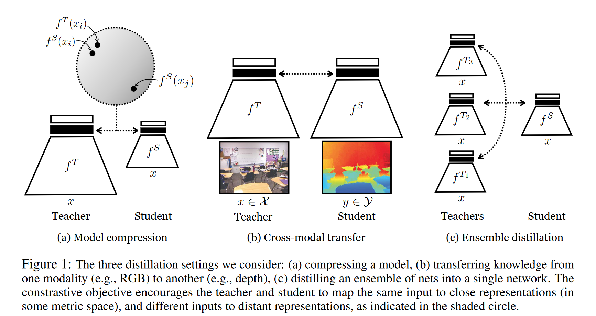

# Contrastive Representation Distillation

[ICLR 2020](https://arxiv.org/abs/1910.10699)	[code in github](https://github.com/HobbitLong/RepDistiller)

*Yonglong Tian, Dilip Krishnan, Phillip Isola*

传统的知识蒸馏将所有目标维度视为互相独立的，而这项工作认为他们之间存在着依赖关系，而传统的蒸馏范式无法传递这种依赖，这项工作希望引入了对比损失，希望捕获相关性和高阶输出之间的依赖关系，通过最大化教师和学生表示之间的互信息的下界来达到这一目的。

## Introduction

知识蒸馏将知识从一个深度学习模型转移到另一个深度学习模型，最初提出的目标是最小化教师和学生之间的KL散度，然而我们往往希望传递一种表征的知识，如在跨模态蒸馏问题中，我们可能希望将图像处理网络的表示迁移到声音或深度处理网络中，使图像的深度特征与相关的声音特征或深度特征高度相关。

表征知识是结构化的，维度之间表现出复杂的依赖关系，而在最开始引入KD将所有目标维度视为独立的，设$y^T,y^S$分别为师生模型的输出，原始KD的分解模式为$\psi(y^S,y^T)=\sum_i\phi_i(y^S_i,y^T_i)$，然而这种因式分解的目标不足以传递输出维度i j之间的依赖关系。

为了克服这个问题，我们希望一个能够捕获相关性和高阶输出依赖关系的目标，这项工作引入了对比目标族，先前工作已经广泛使用，我们将他用于知识蒸馏，并视图捕捉表征空间中的相关性和高阶依赖关系。**我们的目标是最大化教师和学生表示之间的互信息的下界**。我们在知识蒸馏和表示学习两个领域建立起了联系。

## Method

对比学习的核心思想非常通用，为正样本对学习一个在某个度量空间中接近的表示；对负样本对之间的表示远离。

### Contrastive Loss

$f^T,f^S$分别表示教师网络和学生网络，令x为网络的输入，我们将logit之前的一层（倒数第二层）表示为$f^T(x),f^S(x)$，令$x_i,x_j$分别为一个训练样本和一个随机样本，我们要拉近$f^S(x_i),f^T(x_i)$之间的距离并拉远$f^S(x_i),f^T(x_j)$之间的距离，我们定义随机变量S,T为学生和教师对数据的表征
$$
\begin{aligned}
& x \sim p_{data}(x) {\kern 20pt}\triangleleft \ data\\
& S = f^S(x) {\kern 27pt} \triangleleft\  student's\ representation\\
& T = f^T(x) {\kern 27pt} \triangleleft\  teacher's\ representation\\
\end{aligned}
$$
我们考虑联合分布p(S,T)和边缘分布p(S)p(T)的乘积，通过最大化这些分布之间的KL散度，可以最大化学生和教师表示之间的互信息。我们定义一个具有潜变量C的分布q：
$$
q(T,S|C=1)=p(T,S);\ q(T,S|C=0)=p(T)p(S)
$$
我们假设我们的数据中，对于每N个不一致对（取自边缘分布），我们给出一个一致对（取自联合分布），因此对C有先验概率：
$$
q(C=1) = \frac{1}{N+1};\ q(C=0) = \frac{N}{N+1}
$$
由贝叶斯定理，C=1时的后验概率：
$$
\begin{aligned}
& q(C=1|T,S) = \frac{q(T,S|C=1)q(C=1)}{q(T,S|C=1)q(C=1)+q(T,S|C=0)q(C=0)} = \frac{p(T,S)}{p(T,S)+Np(T)p(S)} \\
& log\ q(C=1|T,S) = -log(1+N\frac{p(T)p(S)}{p(T,S)}) \leq -logN + log\frac{p(T,S)}{p(T)p(S)}
\end{aligned}
$$
师生模型之间的互信息：
$$
I(T;S) = p(T,S)log\frac{p(T,S)}{p(T)p(S)} \geq p(T,S)(log\ q(C=1|T,S)+ logN) \geq logN+\mathbb{E}_{q(T,S|C=1)}log\ q(C=1|T,S)
$$
因此最大化师生模型表征空间互信息的下界转化为最大化$\mathbb{E}_{q(T,S|C=1)}log\ q(C=1|T,S)$，我们并不知道q(C=1|T,S)的真实分布，我们通过拟合模型$h:\{\mathcal{T},\mathcal{S}\} \rightarrow [0,1]$到数据分布q(C=1|T,S)的样本来估计它，$\mathcal{T},\mathcal{S}$表示表征空间的定义域，我们最大化该模型下的似然函数：
$$
\mathcal{L}_{critic}(h) = \mathbb{E}_{q(T,S|C=1)}[log\ h(T,S)] + N\mathbb{E}_{q(T,S|C=0)}[1-log\ h(T,S)] \\
h^* = \underset{h}{arg\ max}\ \mathcal{L}_{critic}(h)
$$
假设h能够充分表达，$h^*(T,S)=q(C=1|T,S)$，则上式互信息：
$$
I(T;S) \geq logN + \mathbb{E}_{q(T,S|C=1)}[log\ h^*(T,S)]
$$
最优的h是一个期望下界互信息的估计量，我们希望学习一个最大化与教师表征之间互信息的学生，给出以下优化问题：
$$
f^{S*} = \underset{f^S}{arg\ max}\ \mathbb{E}_{q(T,S|C=1)}[log\ h^*(T,S)]
$$
而优化h依赖于当前的学生，我们弱化边界来克服这一问题：
$$
\begin{aligned}
I(T;S) & \geq logN + \mathbb{E}_{q(T,S|C=1)}[log\ h^*(T,S)] + N\mathbb{E}_{q(T,S|C=0)}[1-log\ h^*(T,S)] \\
& = log(N) + \mathcal{L}_{critic}(h^*) = logN + \underset{h}{max}\ \mathcal{L}_{critic}(h) \\
& \geq logN +  \mathcal{L}_{critic}(h)
\end{aligned}
$$
其中$N\mathbb{E}_{q(T,S|C=0)}[1-log\ h^*(T,S)]$严格为负，不等式仍成立，因此：
$$
f^{S*} = \underset{f^S}{arg\ max}\ \underset{h}{max}\mathcal{L}_{critic}(h) =  \underset{f^S}{arg\ max}\ \underset{h}{max}\ \mathbb{E}_{q(T,S|C=1)}[log\ h(T,S)] + N\mathbb{E}_{q(T,S|C=0)}[1-log\ h(T,S)]
$$
这说明我们可以在学习h的同时联合优化fs，我们注意到$f^{S*}=\underset{f^S}{arg\ max}\ \mathcal{L}_{critic}(h)$，即对任意的h，也是一个优化互信息下界的问题。对于h：
$$
h(T,S) = \frac{exp(\frac{g^T(T)'g^S(S)}{\tau})}{exp(\frac{g^T(T)'g^S(S)}{\tau})+\frac{N}{M}}
$$
其中M是数据集的基数，$\tau$是温度系数，S,T的维度可能不同，$g^S,g^T$对其进行线性变换，并在计算内积之前进行l2规范化。
