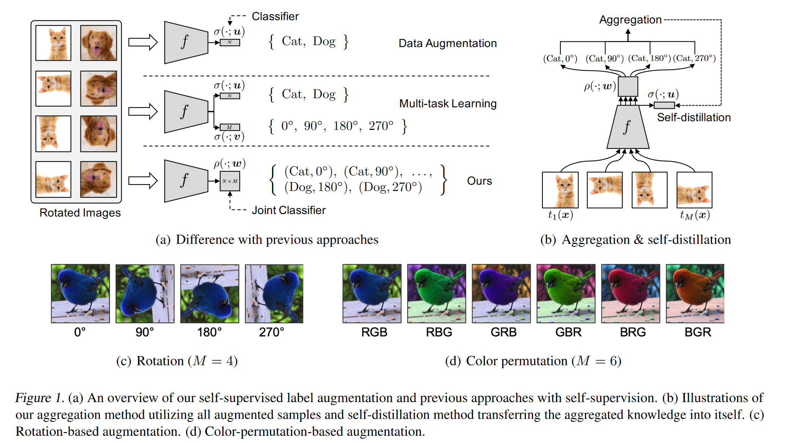
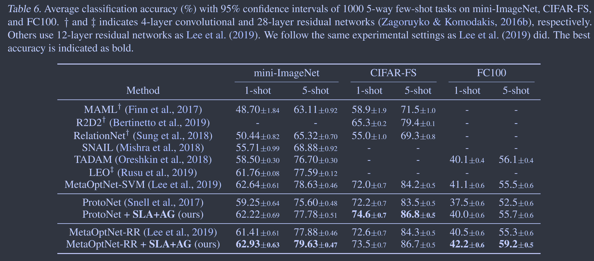

# Self-supervised Label Augmentation via Input Transformations

[2020PMLR](https://proceedings.mlr.press/v119/lee20c.html)	[code in github](https://github.com/hankook/SLA)

**我们的主要思想是学习一个关于原始标签和自监督标签联合分布的同一任务，即通过自监督的输入转换来增强原始标签**

**线性可分的数据经过某些数据增强手段之后可能不在线性可分**

这项工作发现线性可分的数据经过某些数据增强可能会不在线性可分，提出了一种学习原始标签和增强后的统一分布的方法，主要思想是在转换后的样本中除去分类器中不必要的不变属性，并解释了本文的联合分类器与多任务和数据增强的不同点；最后引入了聚合推理和聚合自蒸馏来加快推理的速度。

## Introduction

先前的工作通常为原始任务和自监督任务维护两个独立的分类器（但共享共同的特征表示），并同时优化他们的目标，但这种多任务的学习方式通常不会提高准确性，**我们如何有效地利用基于转换的自监督标签来完成完全监督的分类任务？**

多任务学习方法迫使原始任务的分类器在自监督任务转换方面是不变的，例如当使用旋转作为自我监督时，将每个图像旋转0、90、180、270并同时保留其原始标签，主分类器被迫学习对旋转不变的表示。这可能会导致任务的复杂性增加，因为转换可能会在很大程度上改变样本的特征。

为了应对这一挑战，我们提出一个简单而有效的想法，即学习一个关于**原始标签和自我监督标签联合分布统一的任务**，而不是先前工作中的两个独立的任务，例如对cifar10进行训练，对旋转进行自监督，我们学习所有可能的40个标签。

## Method

对于多任务，在完全监督的环境下，可以指定具有自监督的多任务目标：
$$
\mathcal{L}_{MT}(x,y;\theta,u,v) = \frac{1}{M}\sum^{M}_{j=1}\mathcal{L}_{CE}(\sigma(\widetilde{z};u),y)+\mathcal{L}_{CE}(\sigma(\widetilde{z};v),j)
$$
其中${t_j}_{j=1}^M$是提前定义的转换，$\widetilde{x}=t_j(x)$是经过$t_j$转换的样本，$\widetilde{z}_j=f(\widetilde{x}_j;\theta)$是神经网络f的嵌入表示，$\sigma(·;u)$和$\sigma(·;v)$是主任务和自监督任务的分类器，该损失迫使主分类器对变换$t_j$不变

如果我们不学习自监督任务，则上述损失可以看作是数据增强：
$$
\mathcal{L}_{DA}(x,y;\theta,u) = \frac{1}{M}\sum^{M}_{j=1}\mathcal{L}_{CE}(\sigma(\widetilde{z};u),y)
$$
**我们这项工作的主要思想是在转换后的样本中去除分类器中不必要的不变属性**，我们使用联合分类器来表示其联合分布：
$$
P(i,j|\widetilde{x}) = \rho_{ij}(\widetilde{z};w)=\frac{exp(W^T_{ij}\widetilde{z})}{\sum_{k,l}exp(w^T_{kl}\widetilde{z})}
$$
因此我们的训练目标可以改写为：
$$
\mathcal{L}_{SLA}(x,y;\theta,w) = \frac{1}{M}\sum^M_{j=1}\mathcal{L}_{CE}(\rho(\widetilde{z}_j;w),(y, j))
$$
其中$\mathcal{L}_{CE}(\rho(\widetilde{z}_j;w),(y, j))=-log\rho_{ij}(\widetilde{z};w)$，这个转换只增加了标签的数量，因此对于网络参数的增加几乎可以忽略不计

从优化的角度来看$\mathcal{L}_{MT}$和$\mathcal{L}_{SLA}$考虑同一组标签，但前者需要考虑额外的约束，因此前者要比后者更难优化。

**聚合推理**

对于某个样本，因为我们已经知道他被施加了哪种转换，所以我们不必考虑所有的N*M个样本，因此：
$$
P(i|\widetilde{x}，j) = \frac{exp(W^T_{ij}\widetilde{z}_j)}{\sum_{k}exp(w^T_{kj}\widetilde{z}_j)}; \widetilde{z}_j=f(\widetilde{x}_j)
$$
我们训练一个模型来聚合响应的条件概率来提升分类精度，我们首先对logits进行平均，再计算softmax的概率：
$$
P_{aggregated}(i|x) = \frac{exp(s_i)}{\sum_{k=1}^{N}exp(s_k)}; s_i=\frac{1}{M}\sum^M_{j=1}w_{ij}^T\widetilde{z}_j
$$
**聚合的自蒸馏**

尽管上述推理取得不错的性能，但他需要计算所有的$\widetilde{z}_j=f(\widetilde{x}_j)$，这比单推理要高M倍的开销，因此我们将聚合的知识蒸馏到一个新的分类器中，我们仅需要一个$z=f(x)$即可维护聚合知识，综合损失函数为：
$$
\mathcal{L}_{SLA+SD}(x,y;\theta,w,u) = \mathcal{L}_{SLA}(x,y;\theta,w)+D_{KL}(P_{aggregated}(·|x)||\sigma(z;u))+\beta\mathcal{L}_{CE}(\sigma(z;u),y)
$$
训练结束我们使用$\sigma(f(x;\theta);u)$进行无聚集的推理。

## Experiments & Discussion

**线性可分的数据经过某些数据增强手段之后可能不在线性可分**

单次推理与聚合推理的性能差异：

在小样本和类别不平衡问题上也有不错的表现：

## Future work

这项工作可以给未来研究带来许多有趣的方向：

> 人们可以重新审视之前关于自监督应用的工作
>
> 将这项工作提出的联合学习框架应用到除了小样本或类别不平衡的分类任务之外的全监督任务
>
> 学习去选择对提高主要任务预测准确性有帮助的任务