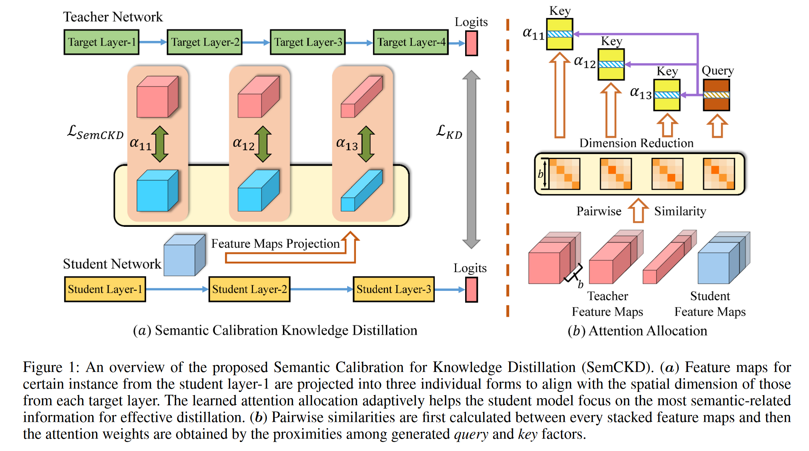
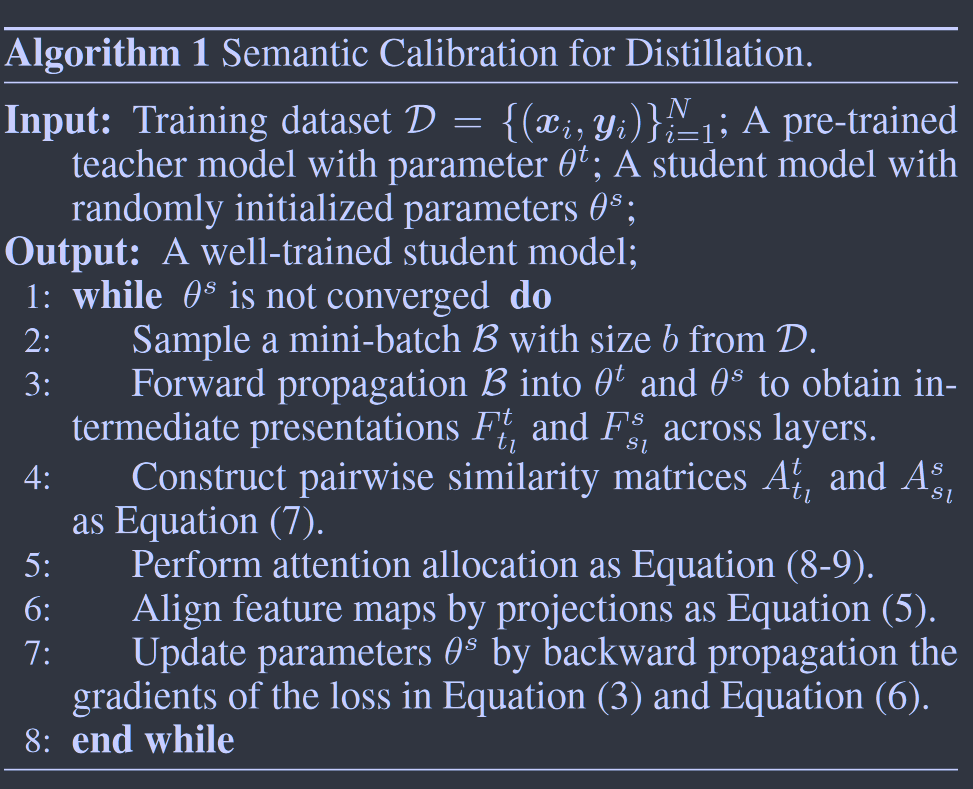

# Cross-Layer Distillation with Semantic Calibration

**[AAAI 2021](https://ojs.aaai.org/index.php/AAAI/article/view/16865)	[code in github](https://github.com/DefangChen/SemCKD)	CIFAR100**	**20240412**

*Defang Chen, Jian-Ping Mei, Yuan Zhang, Can Wang, Yan Feng, Chun Chen*

这项工作提出了一种新的迁移中间层特征的方法，先前工作特征图之间的简单匹配可能会导致语义不匹配，从而出现学生模型中的负面正则化效应，这项工作基于此出发提出SemCKD，在中间层利用相似度矩阵和注意力机制，利用注意力机制计算学生特征图于教师特征图之间的相似程度，有效的将学生层与教师模型中语义相似的层进行绑定，有效抑制了负正则化效应，达到了更好的性能。

***2022CVPR TaT Knowledge Distillation via the Target-aware Transformer*同样指出师生模型特征图直接一对一进行匹配语义不匹配的问题。**

## Introduction

不同能力的教师和学生模型的中间层往往具有不同的抽象层次，一个特殊的挑战的在基于特征映射的蒸馏过程中确保适当的层关联，以实现最大的性能提升。然而现有的工作集中于特征图的特定表示，以捕获丰富的知识，并基于手工设计的层分配实现知识转移。

朴素的分配策略可能会导致候选师生层对的特征图之间的语义不匹配，从而导致学生模型训练中的负面的正则化效应。由于我们无法获得每个中间层语义层次的先验知识，因此层关联成为一个值得研究的问题，需要开发系统的方法以便利用特征图进行更有效和更灵活的知识转移。

我们提出跨层知识蒸馏的语义校准(**Sem**antic **C**alibration for **C**ross-layer **K**nowledge **D**istillation, SemCKD)，通过将迁移保持在匹配的语义级别来利用中间知识，在我们的方法中应用了注意力机制来进行中间层关联，有效的将学生层于教师模型中语义相似的目标进行绑定，通过注意力分配从多个目标层学习，而不是固定分配，可以抑制训练中的过正则化效应。为了对齐每层对的空间维度来计算损失，每个学生层的特征图被投影到与目标层相同的维度。通过语义校准和跨多层特征图迁移，可以在更适合的指导下有效的优化学生模型。

> 提出一种新技术，通过中间层关联的语义校准来显著提高特征图传输的有效性，很容易适用于教师和学生模型使用不同架构的异构环境。
>
> 注意力机制用于实现跨层蒸馏关联，缓解语义不匹配的能力得到了实验结果的支持。

## Method

### Background and Notations

给定一个由K个类别N个样本组成的训练数据集$\mathcal{D} = \{ (x_i, y_i) \}^N_{i=1}$，对于一个b个数据下小批量，将每个目标层tl与学生层sl的输出记为$F^t_{t_l} \in \R^{b\times c_{t_l}\times h_{t_l}\times w_{t_l}}, F^s_{s_l} \in \R^{b\times c_{s_l}\times h_{s_l}\times w_{s_l}} $，c为输出的通道数，h,w为空间维度。$t_l \in [1,...,t_L], s_l \in [1, ...,s_L]$，最后一个全连接层g()的输出logits为$g^s_i=g(F^s_{s_L})\in\R^K$， 预测概率为在softmax上的logit输出$p^s_i = \sigma(g^s_i/T)$， $F^s_{s_l}[i]$表示第i个实例在学生层sl上的输出，$F^s_{s_l}[i, :, :, :]$的简称。

基于以上有经典的损失函数：
$$
\mathcal{L}_{KD_i} = \mathcal{L}_{CE}(y_i, \sigma(g^s_i)) + T^2\mathcal{L}_{KL}(\sigma(g^t_i/T), \sigma(g^s_i/T))
$$

### Feature-Map Distillation

教师模型的特征图对于帮助学生模型获取更好的性能是有价值的，概括为：
$$
\mathcal{L}_{FMD}=\sum_{(s_l, t_l)\in C}Dist(Trans^t(F^t_{t_l}), Trans^s(F^s_{s_l})) \\
\mathcal{L}_{total} = \sum^b_{i=1}\mathcal{L}_{KD_i}+\beta\mathcal{L}_{FMD}
$$
其中Trans()为师生层中对特征图设定的手工设计表示，如注意力图或相似度矩阵。然而这些简单的关联策略可能会造成有用信息的丢失，例如一对一匹配时师生层数不同时会丢弃一些层。

### Semantic Calibration Formulation

我们提出SemCKD，每个学生通过注意力分配自动与语义相关的目标层相关联，鼓励学生收集整合多层信息，以获得更合适的正则化，且SemCKD很容易适用于师生模型层数不同的情况。关联集合C表示为：
$$
\mathcal{C} = \{ (s_l, t_l) | \forall s_l \in [1, ..., s_L], t\in[1, ..., t_L] \}
$$
相应的权重有：$\sum^{t_L}_{t_l=1}\alpha_{(s_l, t_l)} = 1, \forall s_l\in[1, ...,s_L].\ \alpha_{(s_l, t_l)}\in \R^{b\times 1}$表示目标层tl在获取学生层sl的语义感知指导时受到的关注程度。每个学生层的所有特征图被投影成tL个单独的形式，以便于每个目标层的空间维度对齐：
$$
F^{s'}_{t_l} = Proj(F^s_{s_l}\in \R^{b\times c_{s_l}\times h_{s_l}\times w_{s_l}}, t_l), t_l\in[1, ..., t_L]
$$
其中$F^{s'}_{t_l} \in \R^{b\times c_{t_l}\times h_{t_l}\times w_{t_l}}$.

#### Loss Function

对于一个大小为b的小批量，学生模型产生多个跨多层的特征图$F^s_{s_1}, ..., F^S_{s_L}$，损失由均方误差MSE计算：
$$
\begin{aligned}
\mathcal{L}_{SemCKD} &= \sum_{(s_l, t_l)\in\mathcal{C}}\alpha_{(s_l, t_l)}Dist(F^t_{t_l}, Proj(F^s_{s_l}, t_l)) \\
&= \sum^{s_L}_{s_l=1}\sum^{t_L}_{t_l=1}\sum^b_{i=1}\alpha^i_{(s_l, t_l)}MSE(F^t_{t_l}[i], F^{s'}_{t_l}[i])

\end{aligned}
$$
FitNet可以看作是SemCKD的一个特例，FitNet将其中一个师生层对（sl， tl）固定为1，其余层固定为0.

#### Attention Allocation

随着层数的增加，神经网络包含的特征越来越抽象，中间层的语义水平在不同容量的师生模型之间可能存在差异，为了进一步提高蒸馏的性能，每个学生层最好与最语义相关的目标层相关联。

基于注意力的图管理提供了一种可行的解决方案，由于相似实例生成的特征图可能自不同层以不同粒度聚集在一起，因此成对相似度矩阵的相似程度可以作为语义相似度的一个很好的度量，相似性矩阵*[Similarity-Preserving Knowledge Distillation ICCV2019]*计算如下:
$$
A^s_{s_l} = R(F^s_{s_l}) ·R(F^s_{s_l})^T;\ A^t_{t_l} = R(F^t_{t_l}) ·R(F^t_{t_l})^T
$$
其中$R(·):\R^{b\times c\times h\times w} \mapsto \R^{b\times chw},  A^t_{t_l}, A^s_{s_l}\in \R^{b\times b}$，基于自注意力框架，通过MLP将每个学生层和目标层的成对相似度矩阵分别投影到两个子空间，以缓解噪声和稀疏性的影响：
$$
Q_{s_l}[i] = MLP_Q(A^s_{s_l}[i]); \ K_{t_l}[i] = MLP_K(A^t_{t_l}[i])
$$
通过学习MLP生成Query和Key向量，权重参数计算：
$$
\alpha^i_{(s_l, t_l)} = \frac{e^{Q_{s_l}[i]^TK_{t_l}[i]}}{\sum_je^{Q_{s_l}[i]^TK_{t_j}[i]}}
$$
基于注意力的方法提供了一种抑制层不匹配带来的负面影响，并整合了多个目标层的积极引导。

最终的损失函数：
$$
\mathcal{L}_{total} = \sum^b_{i=1}\mathcal{L}_{KD_i}+\beta\mathcal{L}_{SemCKD}
$$

