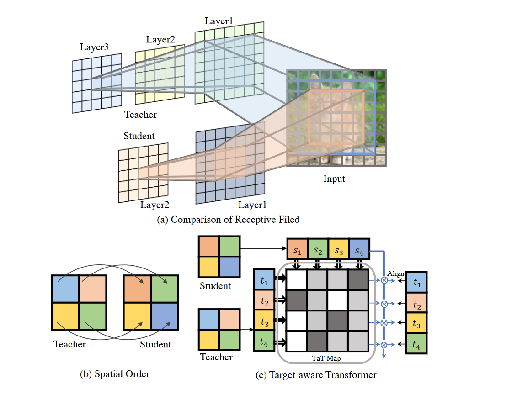
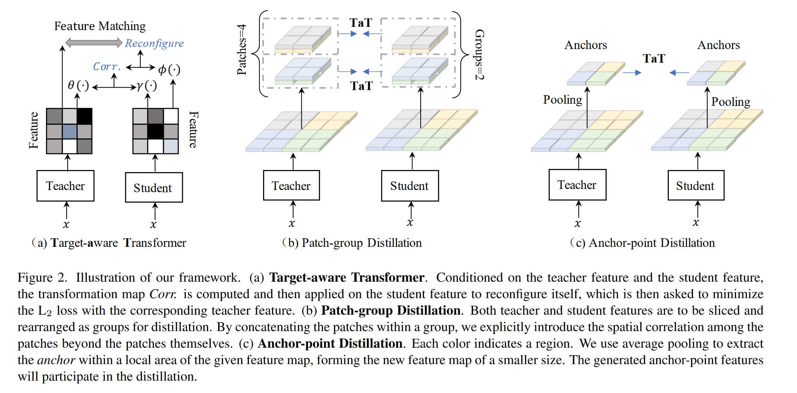

# Knowledge Distillation via the Target-aware Transformer

**[CVPR 2022](https://openaccess.thecvf.com/content/CVPR2022/html/Lin_Knowledge_Distillation_via_the_Target-Aware_Transformer_CVPR_2022_paper.html)	[code in github](https://github.com/sihaoevery/TaT)	CIFAR100  ImageNet  Passcal VOC  COCOStuff10k	20240419**

这项工作针对先前工作中特征图一对一匹配的语义不匹配问题给出解决方案，首先提出了Target-aware Transformer(TaT)，利用教师特征对学生的语义特征进行重建，经过变换的学生特征能够在语义上于对应位置的教师特征保持一致，对于大特征图这个步骤复杂度太高，提出了分组蒸馏和锚点蒸馏，前者将特征图切块进行蒸馏得到局部特征，后者对特征图池化，得到较小的特征图进行蒸馏，得到全局特征，两者相辅相成最终达到不错的性能。

***2021AAAI SemCKD Cross-Layer Distillation with Semantic Calibration*也指出特征图之间的简单匹配可能会导致语义不匹配**

## Introduction

先前方法直接对师生模型的特征图进行一对一的匹配，然而这有一个基本假设是每个像素的空间信息是相同的。然而这中假设通常是错误的，因为学生模型通常比教师模型有更少的卷积层，在相同的空间位置，学生的感受野要比教师的感受野小得多，包含的语义信息也更少。**先前工作已经证明了感受野对模型的表征能力有重要影响。**而这种差异是导致一对一匹配蒸馏导致次优结果的潜在原因。

因此我们提出一种新的一对一匹配知识蒸馏的方法，我们的方法通过参数相关将教师在每个空间位置的特征提炼到学生特征的全部位置，即蒸馏损失是所有学生成分的加权总和。为了对这种关系进行建模，我们制定了一个转换器结构，重建学生特征并于目标教师特征进行对齐，我们称之为目标感知转换器。

> 我们提出通过目标感知转换器进行知识蒸馏，使整个学生能够分别模仿教师的每个空间成分，通过这种方式可以提高匹配能力。
>
> 我们提出分层蒸馏来转移局部特征以及全局依赖关系而不是原始的特征图，这使我们能够将所提出的方法应用于特征图大而遭受沉重计算负担的应用程序

## Method

### Formulation

教师网络T和学生网络S是两个卷积神经网络，$F^T\in\R^{H\times W\times C}, F^S \in \R^{H\times W \times C'}$表示师生模型的特征图，我们提出一个一对一的空间匹配蒸馏管道，允许教师的每个特征位置以动态的方式教授整个学生特征，提出Target-aware Transformer(TaT)在特定位置以像素的方式重新配置学生特征的语义来重建学生特征。使用线性算子避免改变学生语义的分布，变换算子Wi定义为：
$$
W^i = \sigma(\langle f^s_1, f^t_i\rangle, \langle f^s_2, f^t_i\rangle, ..., \langle f^s_N, f^t_i\rangle) = [w^i_1, w^i_2, ...,w^i_N]
$$
我们假定C=C'，则对$F^T, F^S$:
$$
f^s = \Gamma(F^S)\in \R^{N\times C} \\
f^t = \Gamma(F^T)\in \R^{N\times C}
$$
$\Gamma(·)$为将3D张量展成2D矩阵的函数，N = H \* W :
$$
{f^s}^T = [f^s_1, f^s_2, ..., f^s_N] \\
{f^t}^T = [f^t_1, f^t_2, ..., f^t_N]
$$
$\langle·,· \rangle$表示内积, $||W^i||=1$， 我们使用内积来测量语义距离，使用softmax函数进行归一化，通过聚合这些组件，有：
$$
{f^s_i}' = w^i_1 \times f^s_1 + w^i_2 \times f^s_2 + ... +w^i_N \times f^s_N \\
{f^s_i}' = \sigma(f^s·f^t_i)·f^s
$$
为了便于训练，我们引入了参数化方法，该方法在学生特征和教师特征上应用了额外的线性变换，在消融实验中我们证明了参数化的方法效果更好：
$$
{f^s}' = \sigma(\gamma(f^s)·\theta(f^t)^T)·\phi(f^s)
$$
$\theta(·), \gamma(·), \phi(·)$为卷积层+BN层组成的线性函数，$\gamma(·)$可以帮助师生模型的特征通道对齐。通过该变换，${f^s}'$中聚合了原始特征中有意义的语义，增强了表现力，TaT蒸馏损失：
$$
\mathcal{L}_{TaT} = ||{f^s}' - f^t||_2
$$
总损失：
$$
\mathcal{L} = \alpha\mathcal{L}_{task} + \beta\mathcal{L}_{KL} + \epsilon\mathcal{L}_{TaT}
$$

### Hierarchical Distillation

当涉及大型特征图时，TaT计算将变得复杂，计算复杂度为$O(H^2·W^2)$，我们提出分层蒸馏的方法来解决这一问题，首先将特征图切块，对patch进行蒸馏转移局部信息，然后将局部块汇总到一个向量中来提炼全局信息。

#### Patch-group Distillation

先前方法提出将特征图分为多个补丁，在补丁中单独进行蒸馏，但是补丁之间的相关性完全被忽略，导致次优解。

我们提出patch块组蒸馏，允许学生从patch中学习局部特征，并在一定程度上保留他们之间的相关性，给定原始的学生特征$F^S$和教师特征$F^T$，他们被划分为n\*m个大小为h\*w的块，其中h = H/n，w = W / m，其按顺序排列为g组，每组包括p= n·m/g个patch块。

组中的块将逐通道连接，形成一个新的张量大小为$h\times w\times c·g$，这样每个像素位置包含来自原始特征的p个位置的特征，因此蒸馏过程中不仅能够学习单个像素，还能学习他们之间的相关性。

#### Anchor-point Distillation

组块蒸馏能够一定程度保留块之间的空间相关性，但其无法保留长程依赖性，对于复杂场景远距离的依赖关系对于捕捉不同对象非常重要。

我们提出锚点蒸馏来解决这个问题，我们将局部区域汇总为具有代表性的局部区域内的紧凑表示，来描述给定区域的语义，形成尺寸较小的特征图，可以由此近似替代原始特征中的全局依赖关系。我们使用平均池化来提取锚点。

组块蒸馏能获得局部特征，锚点蒸馏能够学习全局表示，两者相互补充，带来两全其美的效果：
$$
\mathcal{L}_{Seg} = \alpha\mathcal{L}_{CE} + \delta\mathcal{L}_{TaT}^\mathcal{P} + \zeta\mathcal{L}_{TaT}^\mathcal{A}
$$

## Future Works

目前旨在主干网络最后一层蒸馏，多个层参与蒸馏时可能会有更多的改进。

没有研究目标检测在其他应用上的有效性，可能需要重新设计新的目标来适应特定应用的性质。
