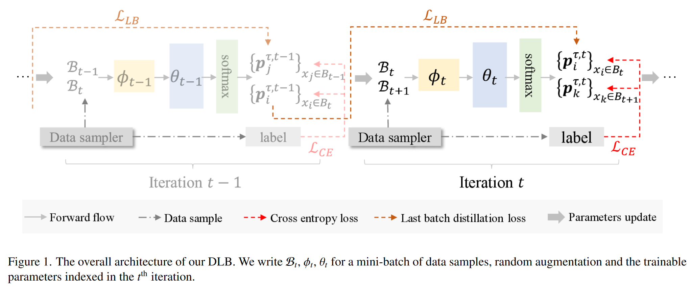
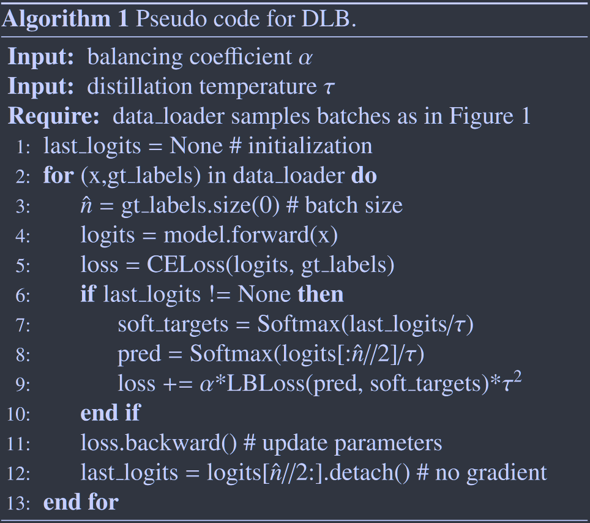

# Self-Distillation from the Last Mini-Batch for Consistency Regularization

CVPR 2022	code in github	CIFAR10/100  TinyImageNet	20240419

这项工作提出了一种新的自蒸馏方法，来解决先前方法丢失即时信息、消耗额外内存、并行化程度低的问题，提出了利用上一次miniBatch输出结果进行蒸馏的方法，在每个批量上一半与上一次的结果保持一致，另一半与下一次的结果保持一致来保持模型的一致性

## Introduction

现有的自蒸馏算法要么需要对网络架构做大量修改(Be Your Own Teacher 2019ICCV)，要么需要保存先前训练的结果来作为自蒸馏的监督信号，这些方法存在着一定的问题，例如，在上一次迭代中最即时的信息被舍弃了；存储过去的模型快照会消耗额外的内存成本增加了并行化的难度，每次梯度的反向传播与该批次上的两次前向传播相关联，导致计算冗余和效率低下。

为解决这些问题我们提出一种简单而有效的自蒸馏方法，称为从最后一个小批量中自蒸馏DLB，DLB只存储最后一次小批量数据中产生的软标签，从而节省了运行内存，提高了计算效率且易于部署和并行化，且每一个前向过程仅与以此反向传播关联，减少了计算冗余。

> 提出了一种简单但高效的基于自蒸馏的一致性正则化方案，命名为DLB，在不修改网络结构的情况下，我们的方法只需要很少的额外计算开销以及内存来实现，利用上一次迭代的最新结果来更新，我们的DLB易于并行化实现，我们的方法同时具有模型无关性和任务无关性
>
> 实验证明了我们的防范具有一致的泛化性且与各种增强策略具有兼容性
>
> 系统性的分析了我们方法的影响，其正则化效果归因于对训练的一致性指导

## Method

具有K类的标记数据集$\mathcal{D} = \{ (x_i, y_i)\}^N_{i=1}$，N为训练实例总数，每一个小批量具有n个样本，$\mathcal{B} = \{ (x_i, y_i)\}^n_{i=1} \subseteq \mathcal{D}$，经过数据增强的小批量$\mathcal{B}^\phi = \{ (\phi(x_i), y_i)\}^n_{i=1}$

### Self-Distillation from Last Batch

我们的方法没有使用复杂的预训练教师模型来提供平滑的标签，而是利用最后一个小批量的备份信息来生成软标签，从而达到训练的一致性正则化，我们使用$\mathcal{B}_t = \{ (x^t_i, y^t_i)\}^n_{i=1}$来表示第t次迭代中采样的原始数据，$\theta_t$表示网络参数，将传统蒸馏损失中的教师分布用t-1次迭代的软标签替换：
$$
\mathcal{L}_{LB} = \frac{1}{n} \sum^n_{i=1} \tau^2·D_{KL}(p^{\tau, t-1}_i || p^{\tau, t}_i)
$$
与先前工作存储整个上一轮训练的网络参数相比，我们在t-1次迭代完成了所有软标签的计算，我们使用数据采样器在t-1次迭代同时获得$B_T, B_{t-1}$，这两组数据在t-1次迭代都更新了交叉熵损失，Bt的预测值通过温度来平滑并存储用于第t次迭代的正则化，总体损失表示为：
$$
\mathcal{L} = \mathcal{L}_{CE} + \alpha·\mathcal{L}_{LB}
$$
我们将每个批量的一半与上一次保持一致，另一半与下一次保持一致

