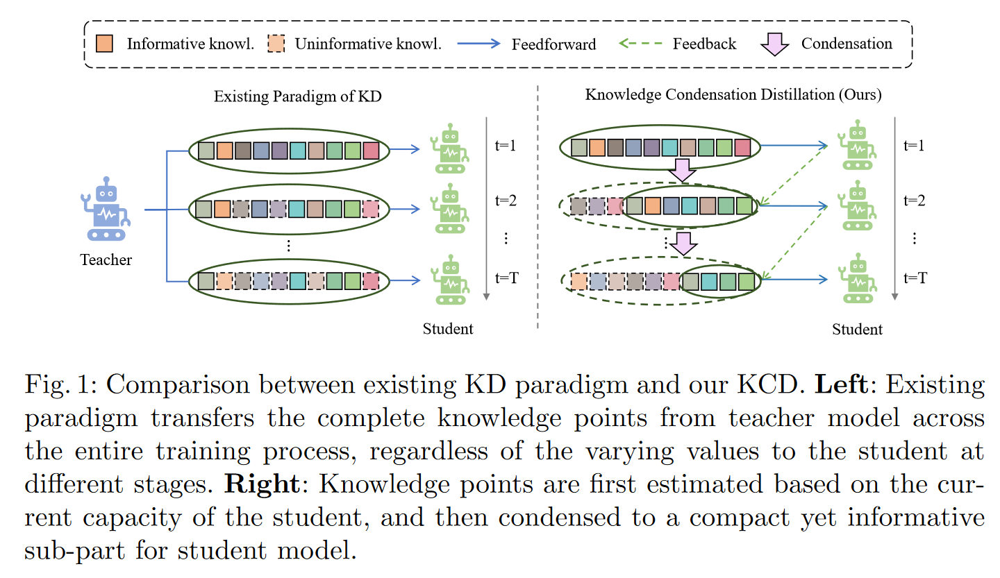
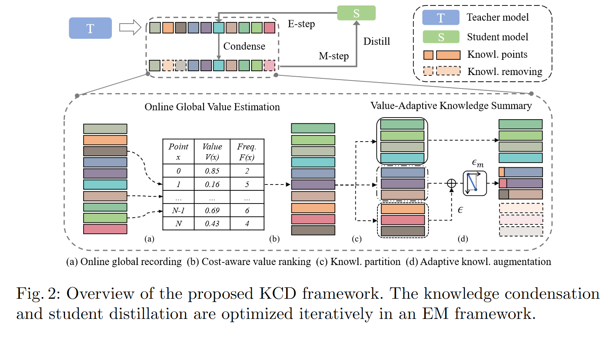
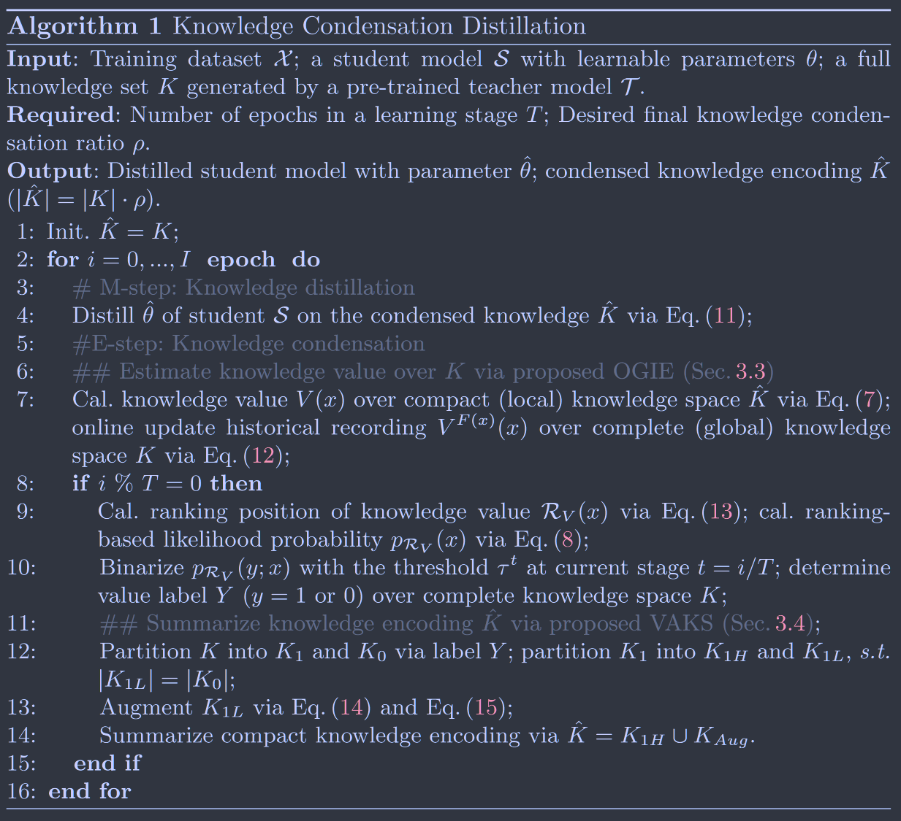

# Knowledge Condensation Distillation

**[ECCV 2022](https://link.springer.com/chapter/10.1007/978-3-031-20083-0_2)	[code in github](https://github.com/dzy3/KCD)	CIFAR100	20240419**

*Chenxin Li, Mingbao Lin, Zhiyuan Ding, Nie Lin, Yihong Zhuang, Yue Huang, Xinghao Ding & Liujuan Cao* 

这项工作认为对于全部的知识进行蒸馏是冗余的，学生模型不应该被动的接收来自教师的所有知识，提出了在线全局价值估计来计算每个知识点对于学生模型的价值，自适应知识总结来获得教师模型中更精简有效的知识编码，将知识划分为三部分，对强知识直接蒸馏，对弱知识直接丢弃，中等知识则用弱知识增强后在蒸馏，由此更高效的对模型进行训练。

## Introduction

现有方法忽略了学生模型在不同学习阶段的变化能力，教师模型的知识对于处于初期学习阶段的学生模型是足够信息量的，但是随着学习的进行不同知识点对于学生的价值开始发生变化。基于此近期的工作开始出现对于知识转移冗余的关注，即学生模型不应该被动的接收来自教师的所有知识。冗余知识不仅需要额外的存储空间还会延长训练的时间，且冗余使得学生模型无法讲足够的精力集中在信息量更大的知识上，削弱了学生模型的学习效能。

针对该问题我们提出一种新的蒸馏框架，核心主要包括两个方面，引入反馈机制来挖掘教师知识在不同阶段对于学生模型的价值；学生主动识别知识的信息性，并逐步提炼出核心知识集来进行蒸馏。KCD将学生模型的知识交织编码为潜变量，构建期望最大化EM框架，逐步浓缩教师知识集合蒸馏给学生。提出一个在线全局价值估计OGVE来动态估计全局知识空间上的知识价值；开发一个自适应的知识总结VAKS模块来生成紧凑有效的知识编码。

> 提出一种新的KD框架，迁移的知识主要有学生模型主动决定，并使用知识集来浓缩知识
>
> 推导了一个期望最大化框架，迭代执行知识凝聚和模型蒸馏来完成知识凝聚蒸馏
>
> 提出OGVE获得知识的近似全局估计量；提出VAKS来协调知识浓缩编码的紧凑性和信息性之间的权衡。

## Method

### Preliminaries 

$$
\mathcal{L}_{KD} =  - \sum_{x\in \mathcal{X}}p_{\mathcal{T}}(x)\ log(p_\mathcal{S}(x)) \tag{1}
$$

我们将每对$(x, p_\mathcal{T}(x))$表示为一个知识点，教师T提供一个知识集合$K = \{ (x, p_\mathcal{T}(x)) | x \in \mathcal{X}\}$，传递给学生S，传统的知识蒸馏，在学生模型的不同学习阶段，知识K固定在整个蒸馏过程中，我们提出迁移知识编码$\hat{K}$，其中的知识点更有价值，能适应不同时期学生模型的需求。有效编码$\hat{K}$可以通过期望最大化EM框架推导出来。

### Knowledge Condensation Distillation

Eq1 的目标是最大化学生模型与教师模型输出的负交叉熵来学习学生模型的参数：
$$
\hat{\theta} = \underset{\theta}{arg\ max}\sum_{x \in \mathcal{X}}\sum_{x\in \mathcal{C}}p_{\mathcal{T}}(x, c)\ log\ p_{\mathcal{S}}(x, c;\theta) \tag{2}
$$
其中C表示类别空间。我们不迁移完整的知识集$K = \{ (x, p_\mathcal{T}(x)) | x \in \mathcal{X}\}$而是引入一个二值变量$\mathcal{Y}\in \{ 0, 1\}^{|K|}$，第i个值表示第i个知识点是否对学生有价值。在外面的设定中：
$$
\hat{\theta} = \underset{\theta}{arg\ max}\sum_{x \in \mathcal{X}}\sum_{x\in \mathcal{C}}p_{\mathcal{T}}(x, c)\ log\sum_{y\in \mathcal{Y}} p_{\mathcal{S}}(x, c, y;\theta) \tag{3}
$$
为了最大化该式子，考虑其下界：
$$
\sum_{x \in \mathcal{X}}\sum_{x\in \mathcal{C}}p_{\mathcal{T}}(x, c)\ log\sum_{y\in \mathcal{Y}} p_{\mathcal{S}}(x, c, y;\theta) \\ = \sum_{x \in \mathcal{X}}\sum_{x\in \mathcal{C}}p_{\mathcal{T}}(x, c)\ log\sum_{y\in \mathcal{Y}} Q(y)\frac{p_{\mathcal{S}}(x, c, y;\theta)}{Q(y)} \\
\geq \sum_{x \in \mathcal{X}}\sum_{x\in \mathcal{C}}p_{\mathcal{T}}(x, c)\sum_{y\in \mathcal{Y}} Q(y)log\frac{p_{\mathcal{S}}(x, c, y;\theta)}{Q(y)} \tag{4}
$$
Q(y) 表示标签Y空间上的分布，$\sum_{y\in \mathcal{Y}}Q(y)=1$，最后一步由jensen不等式推出，且等式成立当且仅当$\frac{p_{\mathcal{S}}(x, c, y;\theta)}{Q(y)}$为常数：
$$
Q(y) = \frac{p_{\mathcal{S}}(x, c, y;\theta)}{\sum_{y\in \mathcal{Y}}p_{\mathcal{S}}(x, c, y;\theta)} = \frac{p_{\mathcal{S}}(x, c, y;\theta)}{p_{\mathcal{S}}(x, c;\theta)} = p_{\mathcal{S}}(y;x,c,\theta) \tag{5} \ \ (Bayes'\ theorem)
$$
去掉Eq4中的常数项$-\sum_{y\in\mathcal{Y}}Q(y)logQ(y)$，结合Eq5，有：
$$
\sum_{x \in \mathcal{X}}\sum_{x\in \mathcal{C}}p_{\mathcal{T}}(x, c)\sum_{y\in \mathcal{Y}}  p_{\mathcal{S}}(y;x,c,\theta) log\ p_{\mathcal{S}}(x, c, y;\theta) \tag{6}
$$
该问题可以通过EM算法来优化：

#### E-Step

这一步我们评估$Q(y) = p_{\mathcal{S}}(y;x,c,\theta)$，首先讨论如何衡量每个知识点的价值：首先先前工作证明如果模型是由教师模型蒸馏得到的而不是单独训练的，平均预测熵会减少，这体现了知识点对学生模型训练的贡献；先前工作还证明编码语义知识往往需要更多的训练时间才能使模型拟合的更好。因此我们使用预测熵来衡量知识点的价值：(*这不就是熵么...起了一堆奇怪的名字搜了半天 谴责！*)
$$
V(x) = -\sum_{c\in \mathcal{C}}p_{\mathcal{S}}(x,c)\ log\ p_{\mathcal{S}}(x,c) \tag{7}
$$
利用预测熵，我们按照递减顺序对V(x)在X上的值进行排序，来估计$ p_{\mathcal{S}}(y;x,c,\theta)$，基于排序位置$\mathcal{R}_V(x)\in \{ 0, 1, ..., N\}$给出知识价值的相对似然概率：
$$
p_{\mathcal{R}_V}(y;x, \theta) = 1 - \frac{\mathcal{R}_V(x)}{|\mathcal{X}|} \tag{8}
$$
则价值标签$Q(y) = p_{\mathcal{S}}(y;x,c,\theta)$可以通过一个阈值来确定，即$\tau:p_{\mathcal{S}}(y;x,c,\theta) = 1 \ if \ p_{\mathcal{R}_V}(y;x, \theta)\geq \tau, 0\ othersize.$

#### M-Step

根据E-step给出Eq6更新后的公式：
$$
\sum_{x \in \mathcal{X}}\sum_{x\in \mathcal{C}}p_{\mathcal{T}}(x, c)\sum_{y\in \mathcal{Y}}  p_{\mathcal{S}}(y;x,c,\theta) log\ p_{\mathcal{S}}(x, c, y;\theta) = \sum_{x \in \mathcal{X}}\sum_{x\in \mathcal{C}}p_{\mathcal{T}}(x, c)\sum_{y\in \mathcal{Y}} \mathbb{I}(p_{\mathcal{R}_V}(y;x, \theta)\geq \tau) log\ p_{\mathcal{S}}(x, c, y;\theta)  \tag{9}
$$
当不提供训练样本时，我们假设y取0 1 在先验上是一致的：
$$
p_{\mathcal{S}}(x, c, y;\theta) = p_{\mathcal{S}}(x, c; y, \theta)p_{\mathcal{S}}(y;\theta) = \frac{1}{2}·p_{\mathcal{S}}(x, c;y, \theta)      \tag{10}
$$
此时分布$p_{\mathcal{S}}(x, c; y;\, \theta) $仅以估计值$Y = \mathbb{I}(p_{\mathcal{R}_V}(y;x, \theta)\geq \tau)$ 为条件，我们只对Y=1的知识点进行蒸馏，因此对Eq2有：
$$
\hat{\theta} = \underset{\theta}{arg\ min}\sum_{x \in \mathcal{X}|Y(x)=1}\sum_{x\in \mathcal{C}} -p_{\mathcal{T}}(x, c)\ log\ p_{\mathcal{S}}(x, c;\theta) \tag{11}
$$
我们在KCD上交替执行E步和M步，前者为了找到标签Y的分布和标签为y=1的知识集合$\hat{K}$，后者在知识集合上进行蒸馏。但是有个问题就是，目前的神经网络是根据小批量样本训练的，**局部样本会阻碍从整个训练数据集X中提取知识集合$\hat{K}$，为解决这个问题我们提出了在线的全局价值估计**。

### Online Global Value Estimation

为了以全局的方式获取有价值的知识集合$\hat{K}$，设计了一个在线全局价值估计(Online Global Value Estimation, OGVE)，来获得在整个数据集上的知识集合。

#### Online Value Recording

我们考虑x的历史统计量，当x在特定的训练迭代中被反馈到网络中，首先统计x参与训练的频率，记为F(x)，用Eq7计算当前训练迭代时的预测熵V(x)，在线更新全局的知识点价值：
$$
V^{F(x)}(x) = \frac{F(x)-1}{F(x)} \times V^{F(x)-1} +\frac{1}{F(x)}V(x) \tag{12}
$$

#### Cost-Aware Ranking

基于全局的$V^{F(x)}(x)$统计量，可以在不引入任何开销的情况下获得更准确的排名$R_{V}(x)$，但是目前两个具有不同训练频率的相似知识点可能会是相同的排名，具有更高训练频率的知识点应当赋予更高的排名：
$$
R_{V}(x) = \underset{x \in \mathcal{X}}{arg\ sort}\ V^{F(x)}(x) \times (F(x))^\alpha \tag{13}
$$
$\alpha$控制F(x)的权重，这不仅考虑了V(x)的状态，还考虑了训练代价F(x),Eq13 Eq8结合可以获得价值标签Y的值

### Value-Adaptive Knowledge Summary

提出价值自适应知识总结VAKS来执行简单的知识编码，包括知识划分和自适应知识增强。

#### Knowledge Partition

根据OGVE，可以得到一个标签集合Y，我们将知识集合根据标签值y划分为$K_1, K_0$，K0集合被认为是没有价值的直接丢弃，K1根据其排名分数进一步划分为$K_{1H}, K_{1L}$，且在数量上$|K_{1L}| = |K_0|$。 K1H的值直接传递给学生，K1L的值虽然是有价值的但被认为在边界状态，我们将对这部分知识进行自适应增强

#### Adaptive Knowledge Augmentation

在对抗攻击中认为一个细微阿扰动可以极大地混淆模型的识别，我们对K1L的知识点进行扰动，我们的目的是对其扰动来增加知识性使其对学生模型来说更具有信息量。

$S=\{ |K_1|, |K_1|-1, ..., |K_{1L}|\}$，我们提出利用K0中移除的无价值信息，以很小的扰动$\epsilon$扩充K_1L中的知识：
$$
K_{Aug} = Ordered(K_{1L}) \oplus Ordered(K_0) \otimes \epsilon(S) \tag{14}
$$
Order(·)根据知识点的值进行降序排序，$\oplus$表示元素级的加法，$\epsilon(S)$是一个从0线性增加到预先给定的$\epsilon_m$的集合
$$
\epsilon(x') = \frac{\epsilon_m}{|K_0|}(x'-|K_1|) + \epsilon_m \tag{15}
$$
因此最终知识集合$\hat{K} = K_{1H} \cup K_{Aug}$

### Overall Procedure

