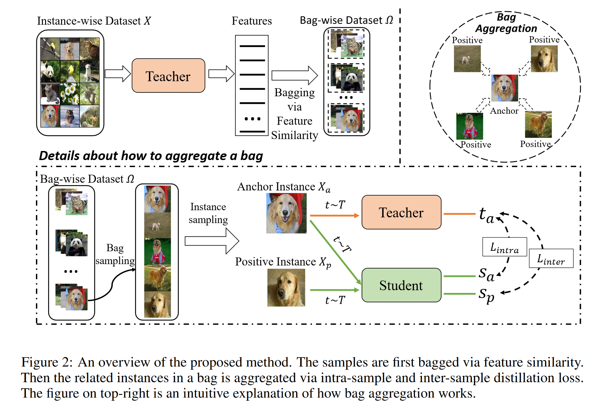

# Bag of Instances Aggregation Boosts Self-Supervised Distillation

**[ICLR 2022](https://openreview.net/forum?id=N0uJGWDw21d)	[code in github](https://github.com/haohang96/bingo)	ImageNet CIFAR10/100	20240419**

*Haohang Xu, Jiemin Fang, Xiaopeng Zhang, Lingxi Xie, Xinggang Wang, Wenrui Dai, Hongkai Xiong, Qi Tian*

这项工作提出将相似的样本装入袋中进行蒸馏来教授学生模型的无监督对比学习蒸馏框架，通过知识丰富的预训练无监督教师模型对数据集进行特征提取，根据特征相似性对数据集进行分组，将相似的数据装入一个袋子中，每个袋子中都有一个锚点，其他样本是与该数据对比来衡量相似性。分好袋后学生模型以袋数据为基础进行蒸馏学习，提出样本内蒸馏损失和样本间蒸馏损失，前者将同一样本的不同增强下的距离拉近，后者将同一袋子中的不同样本距离拉近，以此来指导学生模型学习。

## Introduction 

对比学习需要区分所有实例，由于实例数量众多，这种任务收敛速度慢难以优化，对于小模型来说活，参数太少难以拟合大量数据，受监督学习启发，大模型可以通过知识蒸馏有效提升小模型的学习能力，探索无监督小模型的知识蒸馏成为一个重要课题。

先前的无监督蒸馏方法根据不同实例之间的相似性分布从教师转移知识，然而由于相似性分布是通过维护队列中随机实例来计算的，因此这种知识大多是基于低相关关系实例构建的，无法有效的模拟这些高度相关样本之间的相似性。我们通过聚合相关实例的袋子来转移知识，成为BINGO。

> 我们提出一种新的自监督蒸馏方法，该方法通过匹配教师生成的实例特征的相似性来对相关实例打包，袋装数据集可以通过聚合袋中的实例来有效促进小模型的蒸馏
>
> BINGO为无监督蒸馏提供了一种新的范式，具有高度相关关系的实例之间的知识可能比关系无关的实例更有效
>
> BINGO将ResNet18 34的性能提升到无监督场景中的最佳性能。

## Method

### Bagging Instances With Similarity Matching

给定为标记的训练集$X= \{x_1,x_2, ...,x_N\}$，其相应的袋训练集$\Omega = \{ \Omega_1, \Omega_2, ..., \Omega_N \}$，每个袋数据集由一组实例组成，为了将实例数据集转换为袋数据集，首先将X输入的到预训练的教师模型fT中，获得相应特征$V = \{ v_1, v_2, ..., v_N\}, v_i = f_T(x_i)$，对于数据集中的每个锚点样本xa，我们找到与之具有高度相似性的正样本，将其组成一个袋子，可以由多种方式找到相似样本：

- **K-nearest Neighbors**  对于实例数据集每个锚点样本xa，首先计算与数据集所有样本的成对相似性$S_a = \{ v_a·v_i | i=1, 2, ..., N\}$，对应的袋子：
  $$
  \Omega_a = top-rank(S_a, K)
  $$
  top-rank(·, K)返回集合前K项的索引

- **K-means Clustering**  给定训练集特征集合$V = \{ v_1, v_2, ..., v_N\}$为每个样本i分配一个伪标签qi， $q_i \in \{q_1, ..., q_K\}$，聚类过程最小化下式来执行：
  $$
  \frac{1}{N}\sum^N_{i=1}-v_i^Tc_{q_i};\ \  c_{q_i} = \sum_{q_j = q_i}v_j, \forall j=1, ..., N
  $$
  $c_{q_i}$表示属于标签$q_i$的所有特征的中心特征。对应的袋子定义为：
  $$
  \Omega_a = \{ i|q_i = q_a, \forall i=1, 2, ..., N\}
  $$

- **Ground Truth Label**  如果有gt标签，还可以使用人工注释的语义标签对样本进行打包，给定标签集$Y = \{ y_1, y_2, ..., y_N \}$，对应的袋子为：
  $$
  \Omega_a =\{ i|y_i=y_a, \forall i=1, 2, ..., N\}
  $$

本文我们使用K近邻作为装袋策略。

### Knowledge Distillation Via Bag Aggregation

利用预训练的教师模型获得袋数据集就可以将其用于蒸馏过程中，在前馈过程中，属于同一个袋$\Omega_a$的锚点$x_a$和正样本$x_p$一起取样，我们提出了袋聚集蒸馏损失，包括样本内蒸馏损失和样本间蒸馏损失。

为了将包中的样本表示聚合到更紧凑的向量中：
$$
\underset{\theta_S}{min}\ \mathcal{L} = \underset{x_i\sim \Omega_a}{\mathbb{E}}(L(f_S(x_i), f_T(x_a)))
$$
L是度量两个特征向量之间距离的度量函数，例如余弦相似度、欧几里得距离等。这里我们使用归一化余弦相似性，即自监督学习中常用的对比损失来预测xi和锚点xa之间的距离：
$$
\mathcal{L} =L(f_S(t_1(x_a))), f_T(t_2(x_a))) + \underset{x_i \sim \Omega_a \setminus x_a}{\mathbb{E}}(L(f_S(t_3(x_i))), f_T(t_2(x_a)))) = \mathcal{L}_{intra} + \mathcal{L}_{inter}
$$
t1,t2,t3是来自MoCo-v2增强T中随机抽取的三个独立的数据增强算子。上式第一项侧重于将同一样本的不同增强下的距离拉近，第二项旨在将同一袋子中的不同样本距离拉近，第一项记为$\mathcal{L}_{intra}$样本内蒸馏损失，第二项记为$\mathcal{L}_{inter}$样本间蒸馏损失

#### Intra-Sample Distillation

样本内蒸馏损失是传统对比损失的一个变体，给定一个输入图像的两个增强视图x和x'，MoCo使用在线编码器fq和动量编码器fk生成正特征对q=fq(x), k=fk(x')，对比损失定义为：
$$
\mathcal{L}_{contrast} = -log\frac{exp(q·k^+/\tau)}{\sum_{i=0}^Nexp(q·k_i / \tau)}
$$
在蒸馏过程中，我们用学生模型fs和教师模型ft替换fq和fk，$\tau$为温度系数，$k^-$为内存库中的负样本集合，内存库是数据特征队列，队列大小比批量大小大的多，每次向前迭代过后队列中的项目逐步替换教师网络的当前输出。
$$
\mathcal{L}_{intra} = -log\frac{exp(f_S(t_1(x_a))·f_T(t_2(x_a)) / \tau)}{\sum^N_{i=0}exp(f_S(t_1(x_a))·k_i^-/\tau)}
$$

#### Inter-Sampler Distillation

给定袋$\Omega_a$中的锚点样本xa和正样本xp，我们希望装满相关样本的袋子更紧凑，定义样品间蒸馏损失：
$$
\mathcal{L}_{inter} = -log\frac{exp(f_S(t_3(x_p))·f_T(t_2(x_a)) / \tau)}{\sum^N_{i=0}exp(f_S(t_3(x_p))·k_i^-/\tau)}
$$
样本内蒸馏与样本间蒸馏起着不同的作用，样本内蒸馏的原理类似于传统蒸馏，目的是在给定相同输入的情况下最小化教师和学生模型之间的距离，样本间蒸馏侧重于以袋数据集为载体，从预训练模型中获得的数据关系知识的传递