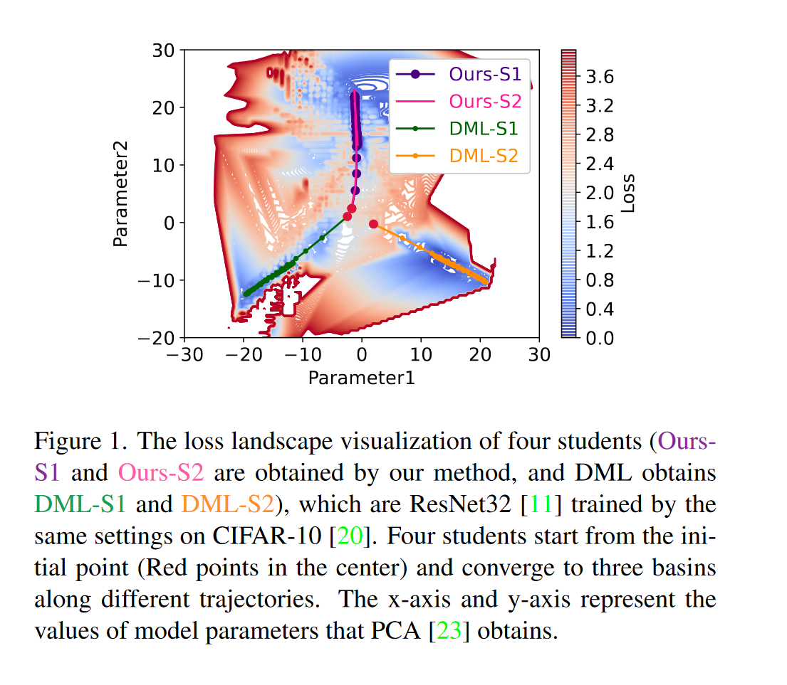
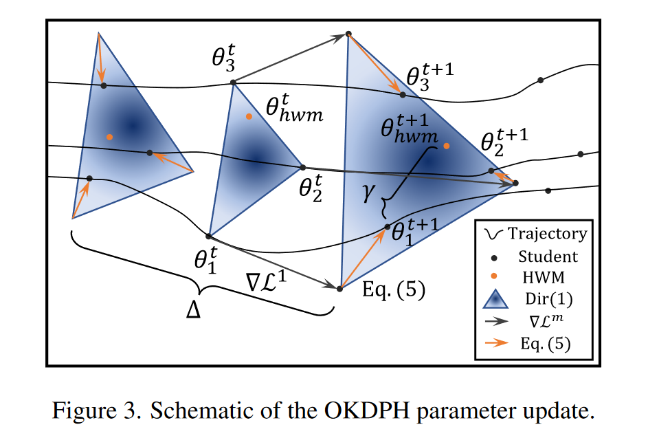
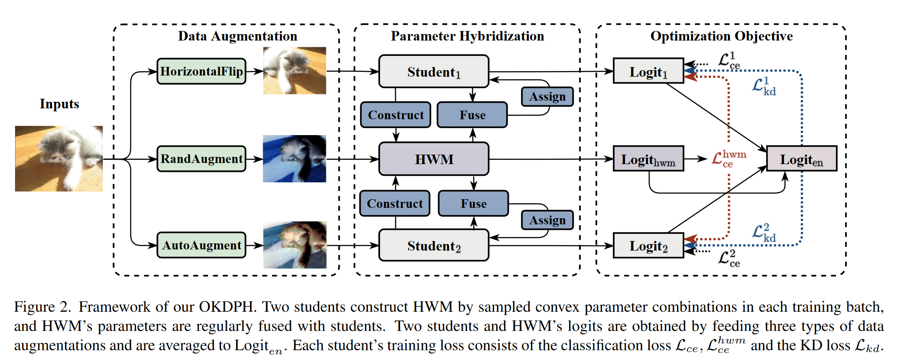
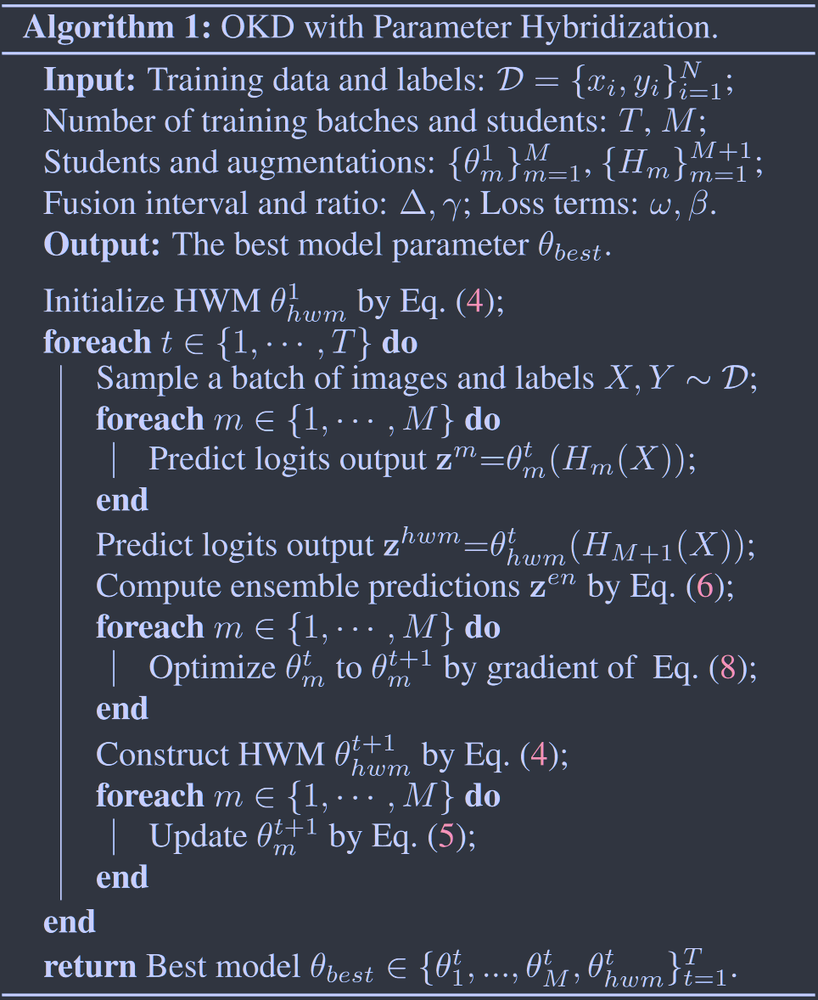

# Generalization Matters: Loss Minima Flattening via Parameter Hybridization for Efficient Online Knowledge Distillation

**[CVPR 2023](https://openaccess.thecvf.com/content/CVPR2023/html/Zhang_Generalization_Matters_Loss_Minima_Flattening_via_Parameter_Hybridization_for_Efficient_CVPR_2023_paper.html)	[code in github](https://github.com/tianlizhang/OKDPH)	CIFAR10/100 ImageNet	20240426**

*Tianli Zhang, Mengqi Xue, Jiangtao Zhang, Haofei Zhang, Yu Wang, Lechao Cheng, Jie Song, Mingli Song*

这项工作提出了一个新的在线知识蒸馏OKD框架，旨在寻找更平坦的最优解，提出了混合权重模型HWM并通过间歇融合策略来帮助模型更好的收敛，并将hwm模型的交叉熵损失融合到整体的训练过程中，对学生模型和hwm施加不同的增强策略，对其输出的logits进行混合，将混合后的logits蒸馏到各个学生模型中指导学生的学习。

## Introduction 

现有的在线知识蒸馏策略侧重于设计复杂的架构，来利用异构只是增强学生的泛化性，但他们缺乏对泛化性的明确约束，这可以通过损失地形的平坦度来体现。我们提出了使用参数混合蒸馏，来促进更平坦的损失最小化和更高的泛化能力。

然而由于神经网络的高度非线性化，直接混合学生的参数很容易导致HWM的崩溃，我们提出间歇融合操作来限制学生之间的差异，保证多模型参数的高度相似性，实现有效的HWM构建。

> 受到多模型融合理论的启发，我们创新地将传统的权重平均扩展到学生参数的即时随机凸组合，称为混合权重模型（HWM）。HWM的监督损失可以估计学生周围损失景观的曲率，并明确衡量泛化能力。
>
> 我们提出了一种全新的可扩展且强大的OKD框架，通过参数混合（OKDPH）实现损失最小值的平坦化，它能够灵活适应各种网络架构，而无需修改同行结构和额外模块。这是第一个操纵参数的OKD工作。
>
> 通过对各种主干网络进行大量实验，我们证明了我们的OKDPH能够显著提高学生的泛化能力，并超越了当前最先进的OKD方法和寻找平坦最小值的SOTA方法。进一步的损失景观可视化和稳定性分析验证了我们的解决方案位于具有统一低损失的区域，并且对扰动和有限数据更具鲁棒性。

## Method

### Parameter Hybridization

经过训练模型的权重是权重空间中的一个点，对多个点进行平均会得到在损失函数地形更平坦的最小值，考虑到OKD的多模型设置，我们将平均过程扩展到使用同行学生的样本凸参数组合来构建混合权重模型（HWM），训练期间为每批样本构建一个HWM：
$$
\theta^t_{hwm} = \sum^M_{m=1}r^t_m\theta^t_m, r^t=[r^t_1, ...,r^t_M] \sim Dir(\alpha) \tag{4}
$$
t表示第t个训练批次，$\theta^t_{hwm}, \theta^t_{m}$为HWM和第m个学生在第t个训练批次时的参数，M是学生人数，$r^t, \sum^M_{m=1}r^t_m=1$为权重向量。$Dir(\alpha), \alpha\in \mathcal{R}^M$为狄利克雷分布，通常被用作多变量抽样的先验分布，HWM可以通过每批次抽样充分探索学生周围区域的参数点，聚合向量$\alpha$可以很容易调整该区域不同点的采样概率，

我们固定$\alpha = 1\in \mathcal{R}^M$来逐渐增加从边界模型到重心的抽样概率，如图，颜色越深采样概率越高。

先前的工作表明，过度参数化的学生在KD损失的监督下也容易彼此原理，导致参数杂交的崩溃，因此需要一个额外的操作来约束学生之间的相似性，来有效的构建HWM，我们将HWM与学生模型以一定的比例进行融合：
$$
If\ mod\ (t, \Delta) = 0:\theta^t_m = \gamma\theta^t_{hwm} + (1-\gamma)\theta^t_m \tag{5}
$$
其中$\Delta, \gamma$表示融合间隔和比率，在epoch上设置$\Delta$，多少轮次之后融合一次。构建HWM对参数空间中学生周围的区域点进行采样，HWM与学生的融合策略控制这个区域的范围防止学生发散。

### Optimization Object and Procedure

学生以及HWM模型接收不同的数据增强，以产生信息丰富且多样化的预测，最后通过平均每个模型的输出logits来综合各种场景中的知识：
$$
z^{en} = \frac{1}{M+1}(\sum^M_{m=1}z^m + z^{hwm}) \tag{6}
$$
其中$z^m, z^{hwm}$为第m个学生模型和HWM模型输出的logits，集成模型的知识通过蒸馏传递给学生模型：
$$
\mathcal{L}_{kd}(z^m, z^{en}) = \tau^2\mathcal{D}_{KL}(\sigma(\frac{z^m}{\tau}), \sigma(\frac{z^{en}}{\tau})) \tag{7}
$$
HWM表示所有学生模型参数空间周围的参数，HWM的多个连续epoch的分类损失$\mathcal{L}^m_{ce}$反映了学生模型区域的范围，因此将该损失整合到学生模型的训练中来最小化该区域的曲率并平坦化损失地形，从而增强学生模型的泛化性能：
$$
\mathcal{L}^m = \omega\mathcal{L}^m_{ce} + (1-\omega)\mathcal{L}^{hwm}_{ce} + \beta\mathcal{L}(z^m, z^{en}) \tag{8}
$$
