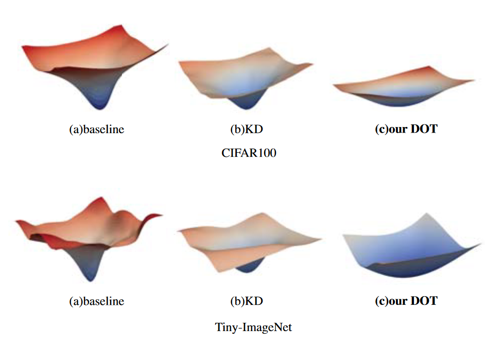
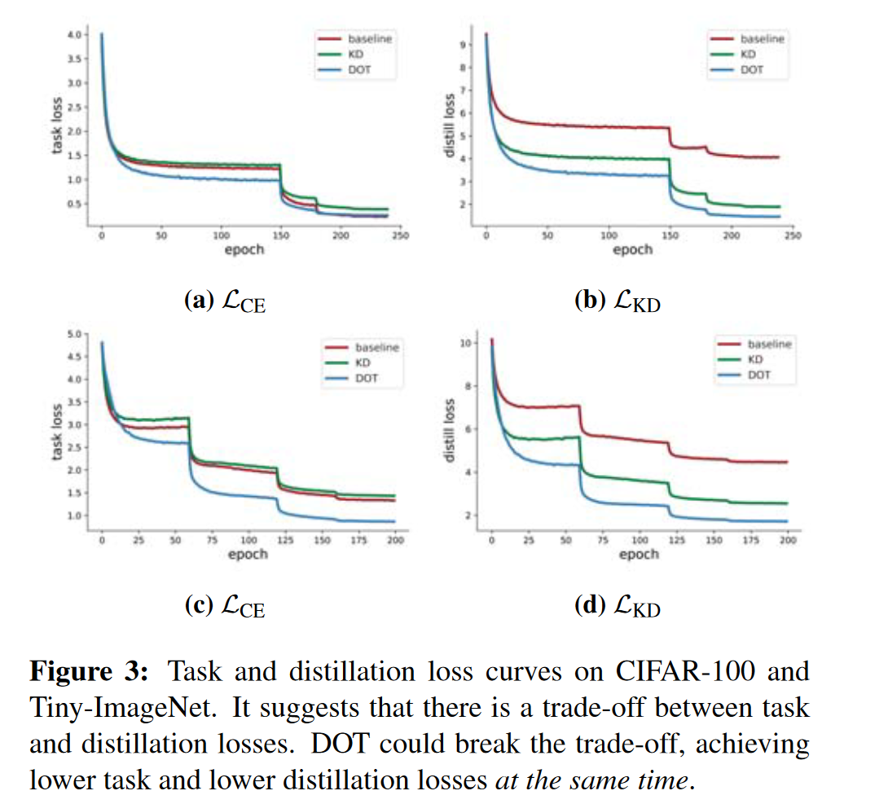
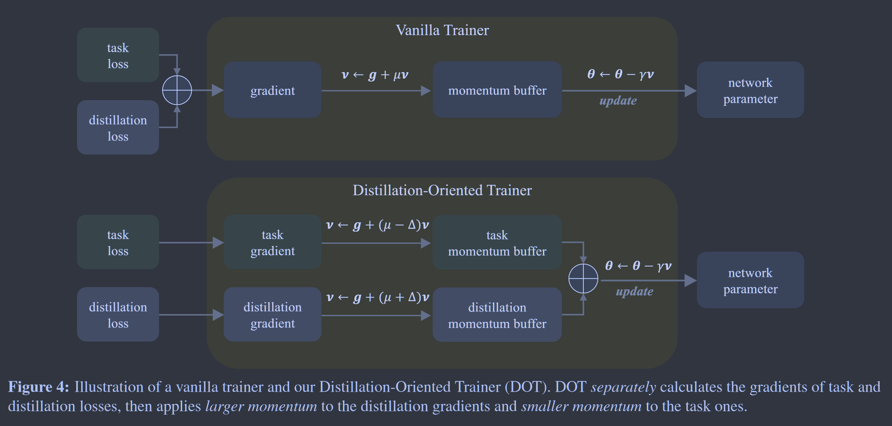

# DOT: A Distillation-Oriented Trainer

**[ICCV 2023](https://openaccess.thecvf.com/content/ICCV2023/html/Zhao_DOT_A_Distillation-Oriented_Trainer_ICCV_2023_paper.html)	[code in github](https://github.com/megvii-research/mdistiller)	CIFAR100  ImageNet-1k  TinyImageNet**

*Borui Zhao, Quan Cui, Renjie Song, Jiajun Liang*

这项工作发现在引入蒸馏损失后并没有如期下降，认为是任务损失与蒸馏损失发生冲突，任务损失和蒸馏损失简单相加可能会导致优化方式退化为多任务学习，而这项工作认为打破这种情况的关键是充分优化蒸馏损失，提供分别调整任务损失和蒸馏损失的动量值来让蒸馏占到主导地位，从而使两种损失都充分收敛达到更好的性能。

## Introduction 

我们主要研究了增量蒸馏损失如何影响任务损失的优化，我们发现蒸馏损失有助于学生收敛到平坦的最小值，由于平坦最小值的鲁棒性，学生倾向于更好的泛化。然而我们还发现引入蒸馏损失会损害任务损失的优化，其并没有像交叉熵损失的基线一样充分收敛。

我们认为这种现象是违反直觉的，由于模型容量较大，教师总是比学生产生更少的任务损失，如果蒸馏损失得到充分优化，任务损失也会减少，因为学生模型会与表现的更好的教师模型相似。

因此这项工作来探索为什么会产生这种现象，并寻求打破它的途径。任务损失和蒸馏损失简单相加组合可能会导致优化方式退化成为多任务学习。我们认为如果蒸馏损失被充分优化，所有的损失都应该下降。因此我们认为充分优化蒸馏损失是打破权衡的关键。

因此我们提出蒸馏导向训练器DOT，它使得蒸馏损失在优化中占据主导地位，它分别考虑任务提供的梯度和蒸馏损失，通过权衡不同的动量来调整优化的方向。给予蒸馏更大的动量使之在优化中占据主导地位。通过这种方式确保蒸馏损失得到充分的优化。

## Revisiting Knowledge Distillation: An Optimization Perspective

### Recap of Knowledge Distillation

KD的损失函数可以表述为：
$$
\mathcal{L}=\alpha\mathcal{L}_{CE}(x,y;\theta)+(1-\alpha)\mathcal{L}_{KD}(x,\phi;\theta)=\alpha H(y,\sigma(p)) + (1-\alpha)D_{KL}(\sigma(\frac{p}{T})||\sigma(\frac{q}{T}))
$$
其中x,y为输入和标签，$\theta,\phi$表示学生网络和教师网络的参数，p,q表示学生网络和教师网络输出的logit，H表示交叉熵损失函数，$D_{KL}$表示KL散度，$\sigma$表示softmax函数，温度系数T用来软化标签。

我们主要研究$\mathcal{L}_{KD}$如何影响优化特性。

### Loss Landscapes

我们可视化了学生网络的损失地形。

与仅使用交叉熵损失的baseline相比，使用蒸馏损失有助于使任务损失收敛到平坦最小值，这解释了学生网络泛化性的改进，仅使用交叉熵损失会导致尖锐的最小值，泛化性较差。因此从优化的角度来看，知识蒸馏方法的改进在于使学生能够收敛到更平坦的最小值。

### Trade-off Between Distillation and Task Losses

我们可视化了训练任务和蒸馏损失之间的优化进度，蒸馏损失的引入大大降低了整体的损失，因为学生的输出变得与教师更加相似，但是任务损失会有所增加，这表明网络试图在任务和蒸馏损失之间找到权衡。

我们试图从多任务学习的角度解释这种权衡，两种损失的目标并不相同，同时学习多个任务使优化变得困难，因此在任务损失和蒸馏损失之间存在权衡是合理的。然而将任务和蒸馏损失优化视为多任务是不恰当的，由于模型容量较大，教师的训练和测试损失都低于学生，让师生相似有助于降低蒸馏和测试损失，因此我们提出一种优化方法使蒸馏损失能得到更充分的优化

## Method

知识蒸馏以更平坦的最小值是学生网络收益，但是在任务和蒸馏损失之间引入了一种权衡，打破权衡的关键是是优化具有一个主导的方向，这可以减少梯度的冲突并保证更好的收敛。由于蒸馏损失帮助学生网络与教师相似来获得更好的泛化能力，因此使其占据主导地位更好。

### Making KD Dominate the Optimization

#### Optimizer with Momentum

对于SGD优化器，使用当前梯度（$g=\nabla_\theta\mathcal{L}(\theta) $）和历史梯度来更新网络参数$\theta$，SGD为网络参数维护一个动量缓冲区v：(loss.backward())
$$
v \leftarrow g+\mu v
$$
参数以梯度下降的规则更新：(optimizer.step())
$$
\theta \leftarrow \theta-\gamma v
$$
$\mu,\gamma$分别表示动量参数和学习率，动量参数通常设置为0.9

#### Independent momentums for distillation and task losses

我们认为在知识蒸馏框架下，为不同损失（蒸馏损失和任务损失）提供的梯度设置独立动量可以在控制优化方向方面发挥重要作用。

蒸馏损失的大动量确保了优化方向在初始的瞬态相位是关于知识转移的；较大的动量使历史梯度值在后期训练中保持不变，从而保证了优化方向的一致性。

#### Distillation Oriented Trainer

我们提出蒸馏导向训练器DOT，DOT为CE损失和KD损失保留了两个单独的动量缓冲器，分别表示为$v_{ce},v_{kd}$，DOT使用不同的动量系数更新这两个动量缓冲器，引入超参数$\Delta$，$v_{ce},v_{kd}$的系数分别设置为$\mu-\Delta,\mu+\Delta$，给定小批量数据，DOT首先计算Lce和Lkd的梯度，然后根据以下更新：
$$
v_{ce} \leftarrow g_{ce}+(\mu-\Delta)v_{ce}\\
v_{kd} \leftarrow g_{kd}+(\mu+\Delta)v_{kd}\\
\theta \leftarrow \theta-\gamma(v_{ce}+v_{kd})
$$
DOT对蒸馏损失LKD施加较大的动量，对任务损失施加较小的动量，因此优化方向由蒸馏损失决定，DOT更好的利用教师的知识而缓解了因优化不足而导致的权衡问题。

### Theoretical Analysis of Gradient

我们将任务损失和蒸馏损失分解为:
$$
v_{ce} = v^{con} + v^{incon}_{ce} \\
v_{kd} = v^{con} + v^{incon}_{ce}
$$
$v^{con},v^{incon}_{ce},v^{incon}_{kd} $分别表示两种损失一致的梯度分量和各自不一致的分量。因此对于sgd：
$$
v_{sgd}=g_{ce}+g_{kd}+\mu(v_{ce}+v_{kd})=g_{ce}+g_{kd}+\mu(v^{incon}_{ce} + v^{incon}_{ce} + 2v^{con})
$$
对于DOT：
$$
v_{dot}=g_{ce}+g_{kd}+(\mu - \Delta)v_{ce}+(\mu+\Delta)v_{kd}=g_{ce}+g_{kd}+(\mu - \Delta)(v^{con} + v^{incon}_{ce}) +(\mu+\Delta)(v^{con} + v^{incon}_{ce}) = 
$$
两者的差异:
$$
v_{diff} = v_{dot} - v_{sgd} = \Delta(v_{kd}^{incon} - v_{ce}^{incon})
$$
这表明当任务损失与蒸馏损失发生冲突，dot会加速蒸馏损失梯度的累计，因此蒸馏损失占据主导使学生网络更好的收敛。
