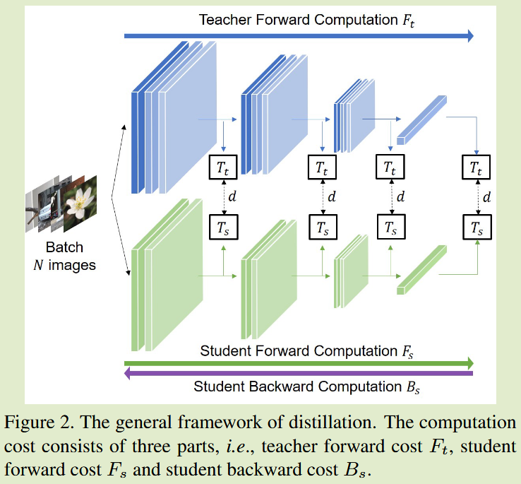
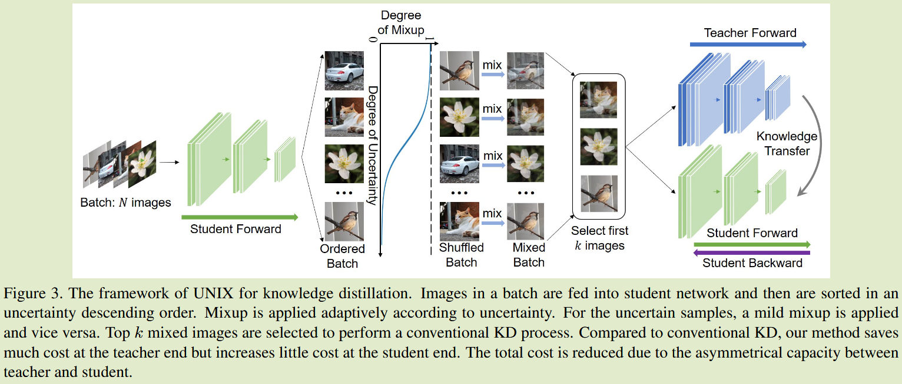

# Computation-Efficient Knowledge Distillation via Uncertainty-Aware Mixup

**[2024 AAAI](https://arxiv.org/abs/2012.09413)	[code in github](https://github.com/xuguodong03/UNIXKD)	CIFAR  ImageNet	20241020	**蒸馏过程

*Guodong Xu, Ziwei Liu, Chen Change Loy*

本文针对蒸馏效率进行了研究，认为传统蒸馏对于简单样本存在着过度学习，利用mixup方法结合不确定性检测，设计了一种输入图像的压缩方法，将置信度高的图像与随即图像混合作为输入来增加复杂度，利用简单样本传递更多的信息，总而减少教师推理的数量来降低总体的复杂度，本文方法只对输入做了改动可以应用到所有的蒸馏方法中。

## Introduction 

本文研究了先前方法都忽略的一个问题，即知识蒸馏的效率，我们的目标是在训练过程中以较低的计算成本来达到与传统知识蒸馏相当的性能。我们认为传统蒸馏的冗余性表现在对于简单样本的过度学习。

我们想要从算法的层面加速蒸馏的过程，我们提出从计算成本的角度来定义效率，即师生网络中前向计算和反向传播的通道数，从而来对比不同的KD方法的效率

- 我们在一个鲜为人知但很重要的领域迈出了重要一步，即KD效率。我们从前向计算和反向传播的计算成本角度定义了效率，允许不同的KD方法之间的比较
- 我们提出一种UNIXKD的框架，我们减少了对于简单样本的过度学习来降低开销

## Method

传统蒸馏的通用表达形式：
$$
L = d(T_t(G_t), T_s(G_s))
$$
t,s表示教师和学生，G表示特征，T表示特征变换

#### KD中的计算成本

KD的计算成本来自三个部分：教师的前向计算，学生的前向计算和学生的反向传播，$F_t, F_s, B_s$表示这些过程的浮点运算数量，N为批量大小，则总代价：
$$
E_{kd} = N · (F_t+F_s+B_s)
$$
更精细的表达：
$$
E_{kd} = N_t·F_t + N_{s1}·F_s + N_{s2}·B_s
$$
其中$N_t, N_{s1}, N_{s2}$分别为经过前述三种计算的样本数量，我们注意到$F_t \gg F_s \approx B_s$，我们可以通过增加$N_{s1}$为代价来减少教师的查询次数Nt，先前工作将Nt次数减少但将Ns1增加到一个灾难的数量，导致了一个很高的计算代价。

#### 不确定感知混合 Uncertainty-Aware Mixup

对于同一图像，教师网络的计算量通常比学生网络要大得多，因此为了节省总计算量，我们牺牲学生端少量的计算来削减对教师网络的推理，首先将一批图像输入到学生网络中，计算其分类不确定性，并进行降序排序，选择前k个图像进行自适应混合，将混合图像输入到两个网络中进行KD过程，我们只改变输入而不改变学习算法，因此可以应用到所有KD算法中。

##### 不确定性估计

我们提出将信息量最大的样本反馈给教师网络，通过不确定性来衡量每个训练样本的难度，一个不能以高置信度分类的样本为一个难样本，能够带来更多的信息，我们通过熵来度量分类结果的不确定性：
$$
U_e(x) = -\sum^C_{i=1}p_i(x)logp_i(x)
$$
更大的熵表示对预测结果的不确定性。另外两种常用的基于置信度和边际测度：
$$
U_c(x) = -\underset{i}{max}\ p_i(x) \\
U_m(x) = -(p_i(x) - p_j(x))
$$
i j分别表示最高置信度和次高置信度的样本标签。

##### 不确定性感知的混合 Uncertainty-Aware Mixup

**我们使用mixup的目的不是数据增强，而是通过mixup将两幅图像压缩到一起来传递更多的信息。**但这难免会导致信息丢失。为了利用压缩效应并减少对样本的破坏，我们将一批样本根据不确定性降序排序，并且还对该批量数据进行打乱来进行混合，并引入一个修正因子c来控制混合水平：
$$
x = (1-c·\lambda)x_{soft} + c · \lambda x_{shuffle}
$$
x_soft x_shuffer均为4D张量，c与每个样本的不确定性相关，不确定性高是c应取小值，来使其更接近与x_soft得到更温和的样本：
$$
c = sigmoid(w·\frac{ranking - b}{batchsize})
$$
b和w为控制sigmoid函数的超参数，合成之后通过KD损失进行模型训练

##### 计算开销分析

计算开销来自于不确定计算和混合图像蒸馏：
$$
E = N·F_s + k·(F_t+F_s+B_s) = k·F_t + (N+k)·F_s + k·B_s
$$
与传统KD相比，学生前向传播增加到N+k次，将教师的前向推理减少到k次，从而降低了总体的开销