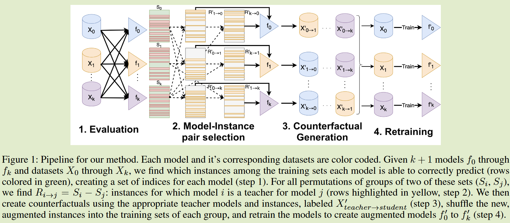
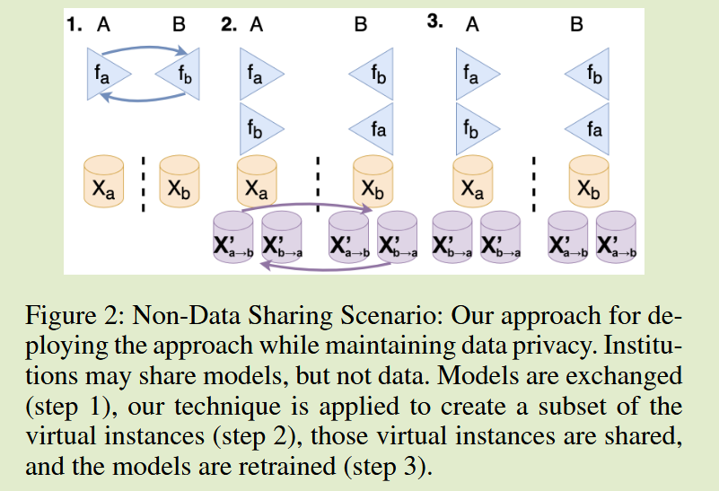
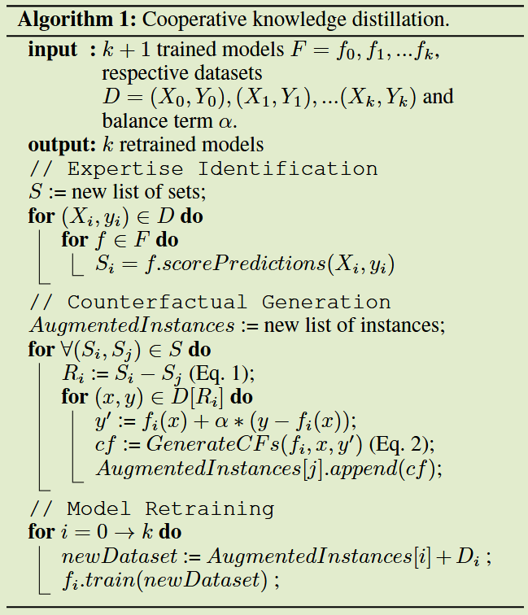

# Cooperative Knowledge Distillation: A Learner Agnostic Approach

**[AAAI 2024](https://ojs.aaai.org/index.php/AAAI/article/view/29322)	no code	FashionMNIST	20241019**

*Michael Livanos  Ian Davidson  Stephen Wong*

本文认为教师模型比学生差的时候知识不应由教师流向学生，提出了一种合作蒸馏的方法，筛选每个模型擅长的类别以及缺陷的部分，用其他模型擅长的部分弥补模型的缺陷，提出了一种反事实样例，通过擅长模型生成对应类别样例，经过数据增强后用于缺陷模型的学习，通过这样的流程来完善模型本身的性能。

## Introduction

现有的知识蒸馏方法存在局限性，经过训练的教师模型教授学生时，即使教师的表现比学生差，仍然是由学生来学习；现有知识蒸馏具有单向性和单一性，知识只能从教师流向学生而不能从学生流向教师。

我们提出合作蒸馏的方式，将知识蒸馏扩展到新的环境中，每个学习者都可以被认为是任务的一个或多个特定方面存在不足的专家，并且可以帮助克服彼此的局限性，目前现有的蒸馏方法是无法达到这一目的的。

我们在FashionMNIST上创建实验，创建10个分类器（每个类别一个）其中一个类屏蔽来创造一个缺陷，由于他只能看到很小一部分，因此很难进行正确分类，需要其他模型来教授该模型。

- 我们提出一种简单有力的方法实现一种新的蒸馏方法，称之为合作蒸馏，通过一种新颖类型和反事实来实现的
- 结果对各种基础和复杂的学习器都有较好的应用前景。
- 我们展示了我们的方法在各种设置下的良好性能
- 我们的方法在迁移学习、自监督学习和知识蒸馏中可以显著地超越多个最先进和最实用的基准

## Method

每个模型既可以充当学生，也可以充当老师，而不是从单个教师模型向学生模型蒸馏；我们使用反事实来生成有针对性的实例来传递知识，而不是像传统知识蒸馏那样在所有实例中提取知识，这是一种合作的形式，学生发现了自己表现不佳的实例，而教师创造了一个更容易理解的反事实。

我们方法包括三个基本步骤：

- 专家识别：模型i选择实例I，它可以准确的预测
- 缺陷识别：由I可知，其他每个模型j都会发现一个无法预测的实例$R_{i\rightarrow j} \subset I$
- 合作蒸馏：对于每个实例$x\in R_{i\rightarrow j}$，i生成反事实x'加入到j的训练集中

#### 专长与缺陷识别

由于每个模型可能对该领域的知识有限，因此至关重要的是充当教师的模型只有在他们是合格教师的情况下才会这样做。关于实例x，一个模型i被认为有资格教授学生模型j当且仅当模型i正确的预测了实例x而模型j没有。这样一个合格的教师教授了一个缺乏知识的学生模型

我们将所有训练数据X传递给每个模型，收集能够正确预测的实例的标签集来确定哪些模型来充当教师的角色，设Si为模型i能够正确预测的类别集合，$R_{i\rightarrow j}$是模型i能够正确预测而j不能正确预测的集合：
$$
R_{i\rightarrow j} = S_i - S_j
$$
即使数据集无法共享，在共享模型之后分别在各自的数据集上生成虚拟实例，对这些共享示例进行共享。

#### 反事实样例生成

反事实实例在给定三条信息的情况下生成虚拟实例：模型f，实例x和期望输出y'，使得虚拟实例x'与x相似且$f(x') = y'$，大多数工作是直接翻转，我们找到适合的实例-教师对(f, x)，我们选择设定$y' = f_i(x) + \alpha(y-f_i(x))$，其中$\alpha$编码教师模型的影响力，$\alpha$越接近于1，$y'$越接近y(真实标签)；$\alpha$越接近于0，$y'$越接近于

原实例分配正确的反标签后，经过数据增强后加入到学生模型的训练集中，重新训练模型：
$$
\forall x\in R_{i\rightarrow j}\ argmin_{x'}\ d(x', x) + \lambda|f_j(x') - y'|^2
$$
$R_{i \rightarrow j}$表示模型i可以教授模型j的类别集合

​	

#### Algorithm 1：

- 计算每个类的得分，得到类别集合Si
- 针对j模型，根据i模型的输出和真实标签获得伪标签，通过$\alpha$来控制趋近于真实标签还是模型i的软输出，生成反样例来用于模型j的训练，将i的知识传递给j
- 将获得的反样例加入到训练集中，重新训练模型