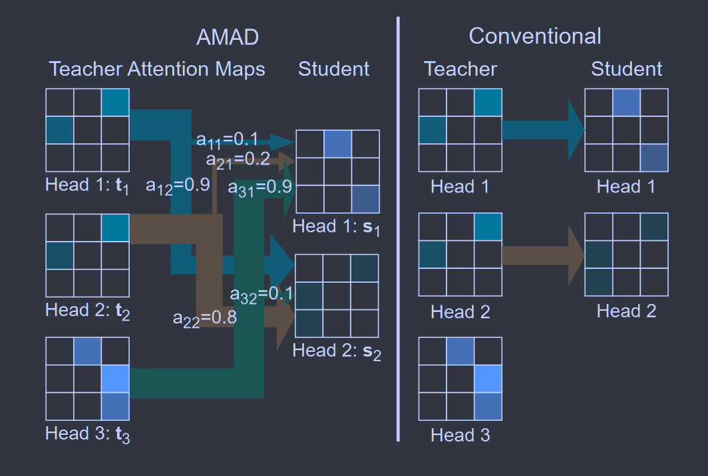
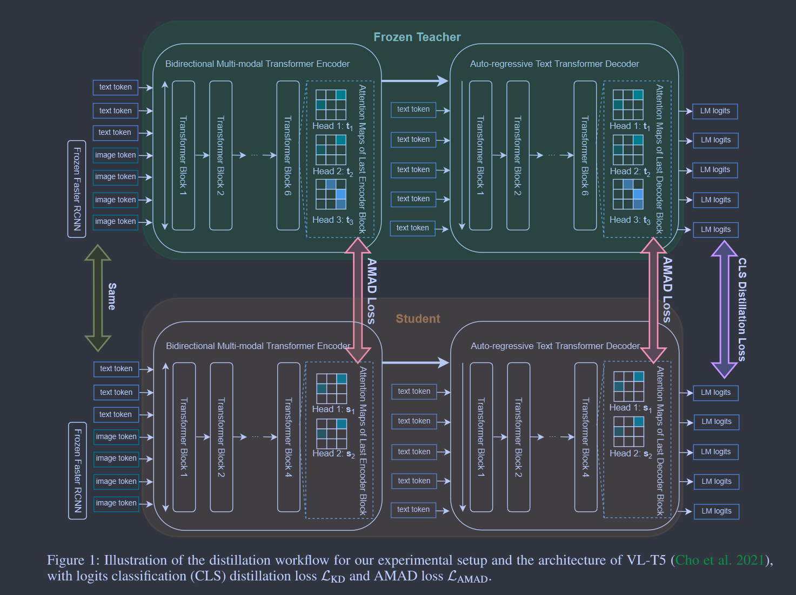

# No Head Left Behind - Multi-Head Alignment Distillation for Transformers

**[AAAI 2024](https://www.amazon.science/publications/no-head-left-behind-multi-head-alignment-distillation-for-transformers)	code in Appendix	MS-COCO  VQA-2.0  Multi30K	20240517**

*Tianyang Zhao, Kunwar Yashraj Singh, Src'cikar Appalaraju, Peng Tang, Vijay Mahadevan, R. Manmatha, Ying Nian Wu*

针对多头注意力的蒸馏方法，先前工作一对一的方式没有考虑语义的对齐性，并且不同数量的注意力头不能完美的匹配，这项工作针对这个问题提出了注意力图对齐蒸馏，利用教师头和学生头之间的余弦相似性，教师头指导每一个学生头，权重由相似性控制，基于这种思想给出了4中变体的AMAD损失。

- 不同数量注意力头的对齐策略

## Introduction

先前针对多头注意力模块的注意力图蒸馏方法，都直接以一对一的方式来最小化教师和学生每个头的注意力之间的差异，这些方法只能应用到教师和学生具有相等头数的情况，不同头数的情况必须在蒸馏中舍弃掉多出的头。

我们提出注意力图对齐蒸馏AMAD。AMAD使用余弦相似度对教师和学生注意力图中的不同头部进行软对齐，每个教师负责所有的学生，且对余弦相似度更高的学生头贡献更大。AMAD的运作可以看作是交叉注意力。

与视觉/语义token不同的是，注意力头不具有语义顺序，即使教师和学生具有相同的注意力头数量，我们仍然不能假设教师和学生的注意力头在语义上是对齐的。传统的注意力图蒸馏方法强制学生头与教师头具有完全相同的顺序，而AMAD允许基于相似度对齐的蒸馏不受头顺序的限制，每个教师教授所有的学生，贡献与其相似度成正比。

> 提出注意力图对齐蒸馏AMAD，针对具有不同数量注意力图的师生模型，AMAD让每个教师头教授所有的学生头，权重由教师头和学生头的相似度决定
>
> 即使没有VL预训练，经过蒸馏的VL-T5优于同样大小的VL预训练的VL-T5模型 （针对先前工作的比较）

## Method

### Variants 1

在Transformer的多头注意力中，对每一个注意力头h，注意力矩阵$A_h\in\R^{q\times k}$
$$
A_h = softmax(Q_hK_h^T/\sqrt{d_k}) \tag{1}
$$
对于每个训练数据样本，给定的H-head多头注意力层的所有头的注意力图形成一个$[A_1, A_2, ..., A_H]\in\R^{H\times q\times k}$的张量，AMAD旨在提取$H_s \leq H_t$的注意力图，为了便于表示，令$n=q·k, t_i\in\R^n$表示教师头矩阵的扁平化表示，$s_j\in\R^n$表示学生头矩阵的扁平化表示。师生头之间的余弦相似度表示为：
$$
w_{ij} = \frac{t_i·s_j}{||t_i||_2·||s_j||_2} \\
a_{ij} = \frac{exp(w_{ij})}{\sum^{H_s}_{m=1}exp(w_{im})} \tag{2}
$$
对计算的余弦相似度权重矩阵施加softmax将其赋予非线性性，来获得对每个学生头的蒸馏贡献参数a_ij

最小化给定的归一化教师头注意力图ti和软对齐的学生注意力图的加权和之间的均方误差：
$$
\mathcal{L}_{AMAD_i} = ||\frac{t_i}{||t_i||_2} - \sum^{H_s}_{j=1}a_{ij}·\frac{s_j}{||s_j||_2}||^2_2 \tag{4}
$$
总体的AMAD损失为所有教师头的损失的和：
$$
\mathcal{L}_{AMAD} = \sum^{H_t}_{i=1} \mathcal{L}_{AMAD_i} \tag{5}
$$
将其改写为矩阵的形式，$T\in\R^{H_t\times n}$, 其每一行表示教师的第i个头的归一化扁平表示$t^T_i/||t_i||_2$， 学生矩阵$S\in\R^{H_s\times n}$同理
$$
\mathcal{L}_{AMAD} = ||T-softmax_{dim=row}(TS^T)S||_2^2	\tag{6}
$$
上式矩阵的第i行计算即为Eq4. 

我们的方法与以往的最小化二范数或KL散度的方法不同，先前方法需要T S具有相同的形状，我们破除了这一限制，支持更灵活平滑的蒸馏

### Formulation Variants

#### Variant 2: KL Divergence

$$
\mathcal{L}_{AMAD-2} = KL(T||softmax(TS^T)S)	\tag{9}
$$

#### Variant 3: Parameterized Projection

借鉴注意力机制的思想，在计算相似度之前，在学生的每个扁平向量上应用一个可学习的线性投影$W\in\R^{n\times n}$：
$$
\tilde{S} = ReLU(SW^T+b) \\
\mathcal{L}_{AMAD-3} = KL(T||softmax(T\tilde{S}^T)\tilde{S})	\tag{11}
$$

#### Variant 4: Token-level Alignment

提出更细致的token级别的对齐，$T_l\in\R^{H_t\times k}$为教师第h个头注意力图$A_h\in\R^{q\times k}$第l个行向量$t^T_{h, l}\in\R^k$的矩阵，学生同理：
$$
\mathcal{L}_{AMAD-4} = \sum^q_{l=1}KL(T_l||softmax(TS_l^T)S_l)	\tag{12}
$$
实验表明在VL-T5 + VQA2.0数据集的环境下，变体2的性能最佳