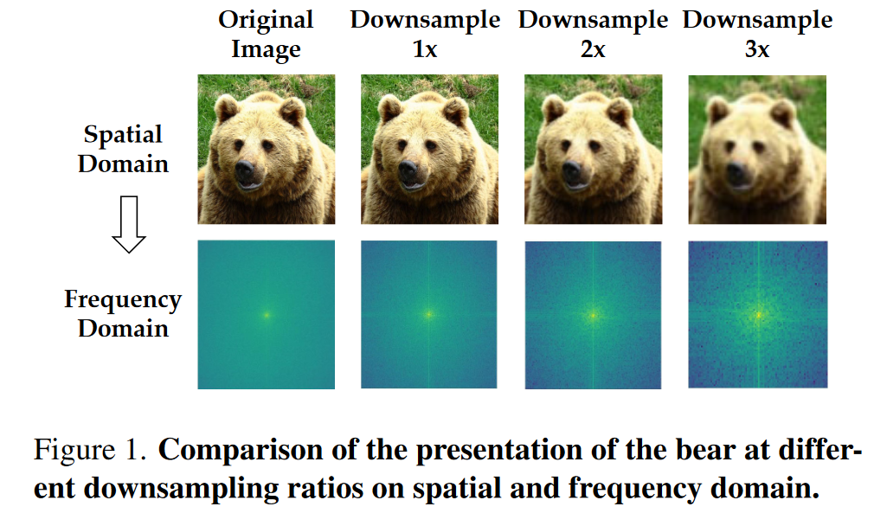
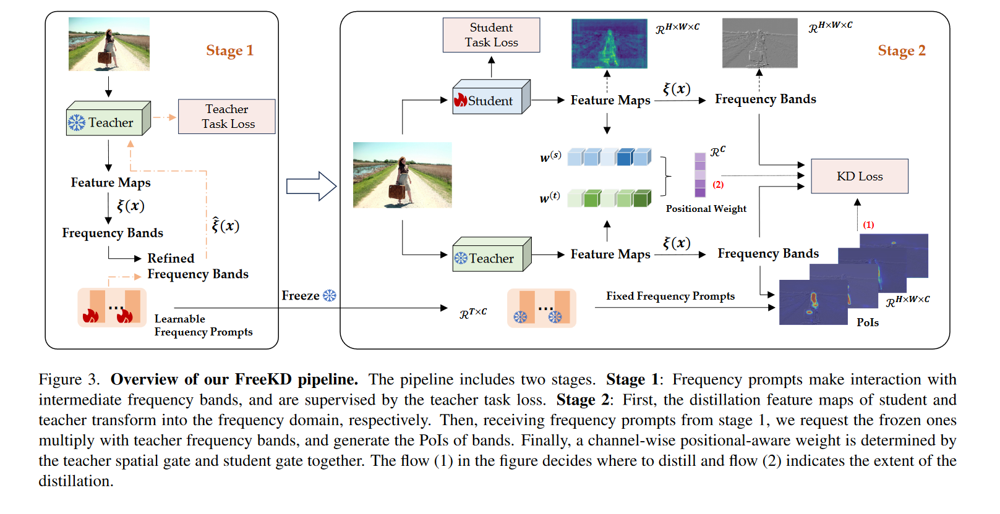
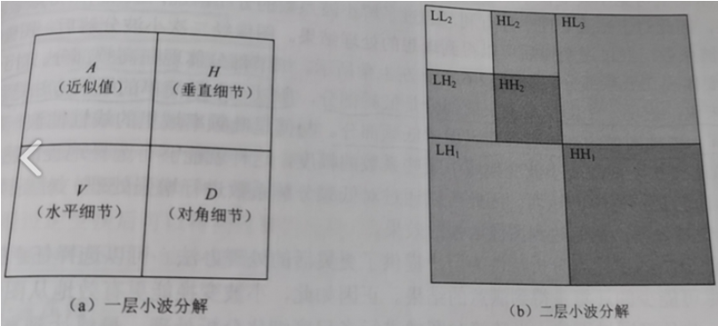

# FreeKD: Knowledge Distillation via Semantic Frequency Prompt

**[CVPR 2024](https://arxiv.org/abs/2311.12079)	no code	MS COCO	20240503**

*Yuan Zhang, Tao Huang, Jiaming Liu, Tao Jiang, Kuan Cheng, Shanghang Zhang*

首次提出从频率域对特征进行蒸馏学习，对教师模型提出使用提示Prompt模块并结合Jaccard相似性系数来获得掩码图计算频率域中的兴趣点集合，从而来提高蒸馏的效率；对学生模型提出位置相关损失来为学生模型提供更高阶的空间增强，通过小波变换转换到频率与并通过MSE损失来模仿其频率特征。

## Introduction

近期工作旨在通过空间级的蒸馏损失来提高性能，在特征图中蒸馏有价值的信息，应用于教师模型空间域的顺序下采样引入了一种污染，阻碍了学生辨别应该模仿的具体信息能力，导致准确性下降。

降采样显著地去除了频域中的高频细节，这一观察促使我们探索利用频率信号进行知识蒸馏。这种方法会带来两个挑战，来自教师模型低频段传递了一般但最少的上下文信息，其特征是平滑变化的；高频范围提供了更细粒度和独特的信号，显著的转换增强了学生的稳健性和泛化能力。然而，当学生模仿高频像素时也会捕获噪音。

我们引入语义频率提示来应对这些挑战，提出称为FreeKD(**Fre**quency**K**nowledge**D**istillation)的蒸馏框架.

> 我们从频率域引入一种新颖的知识蒸馏方式，并首次尝试探索其在稠密预测任务上的蒸馏潜力，突破了基于空间方法的瓶颈
>
> 首次提出频率提示方法，特别是用于频率知识蒸馏，消除来自频率波段的不利信息，并提出了一种位置感知的关系频率损失，以增强密集预

## Method

### Distillation with Frequency

母函数的伸缩和平移定义了一个正交小波基：
$$
\Phi_{(s,d)}(t) = 2^{\frac{s}{2}}\Phi(2^st-d),\ s,d\in Z
$$
其中Z是所有整数的集合，因子s/2保持一个与尺度s无关的常数范数，变量s和d在L2空间中对母函数$\Phi$进行平移和缩放，为了创建频率表示，离散小波变换DWT$\xi$通过$\Phi$对每个通道进行如下的频带分解：
$$
\mathcal{B}_l = \xi(x)
$$
其中l为分解水平，当l=1时，特征图$F\in\R^{C\times H\times W}$能够分解为4个频带，$\mathcal{B}_1 = \{LL, HL, LH, HH\}$，其中LL白哦是低频带($R_{LL}\in\R^{C\times H_{LL}\times W_{LL}}$)，其余为好拼带。l取2时，LL频带可以进一步分解为LL2, HL2, LH2, HH2。本文我们设置l=3.

（低频部分代表了趋势，也叫**近似信号**；高频部分代表了噪声，也叫**细节信号**）

**补充知识：** [refs](https://www.cnblogs.com/pam-sh/p/14534453.html)

LL频带（A）是图像内容的缩略图，保持了原图的内容信息；LH频带（V）含有水平方向的高频边缘信息；HL频带（H）还有竖直方向的高频边缘信息，HH频带（D）含有对角方向的高频边缘信息，反映了水平和竖直方向上图像灰度的综合变化。

$F^{(t)}\in\R^{C\times H\times W}, F^{(s)}\in\R^{C_s\times H\times W}$分别表示师生模型的特征图，为了模仿频率带我们提出：
$$
\mathcal{L}_{FKD} = \sum^L_{k=1}||a_k - b_k||_1 \\
a_k \in \xi(F^{(t)}), b_k \in \xi(\phi(F^{(s)}))
$$
L为频带数，$\phi$为线性投影层，使师生特征图分辨率对齐，学生模型通过低频模型学习一些一半规律，从高频学习显著模式，包括精细纹理、边缘和噪声

### Semantic Frequency Prompt

我们引入一个可学习的频率提示$\mathcal{P}\in\R^{B\times T\times C}$，在B个频率带的C个通道中传递T个像素，并且首先对教师模型进行微调，与以前的空间相关性提示的插入方法不同，我们的方法要求频率提示与频带进行交互，更好的了解嵌入在频率空间中的特征，我们采用矩阵乘法的方式来计算提示P和教师频带中的频率像素Rt之间的互信息$M\in\R^{C\times H_{HH}W_{HH}}， R^{(t)}\in\R^{B \times C \times T}, T=H_{HH}W_{HH}$
$$
M = P\times R^{(t)}
$$
我们将HH频段拉直来拟合矩阵乘法。为了连接任务损失和支持随机梯度下降，使用一个masked频带来代替原始的频带HH：
$$
\hat{R^{(t)}} = \sum^T_{i=1}\sigma(M_i) ⊛ R^{(t)}
$$

> 这里的mask掩码应该是想要遮盖住部分与Prompt互信息较小的频段值

我们**将互信息M转化为一个概率空间，作为掩码发挥作用**，$\sigma$表示sigmoid函数⊛表示逐元素乘法，收集所有的带mask的频带之后将他进行离散小波变换IDWT$\tilde{\xi}$到空间域：
$$
\hat{F^{(t)}} = \tilde{\xi}{(\hat{\mathcal{B}_l})}
$$
将新的特征图$\hat{F^{(t)}}$返回给教师模型，微调损失可作为mask质量的标准，并最小化来迫使频率提示集中在该波段中的关键像素

然而简单的最小化$\mathcal{L}_{finetune}$会导致有频率提示产生的T组掩码崩溃，可能会学习一些掩码直接恢复所有的波段即处处值都为1而失去作用。因此为了使提示模块能够表示该波段T个兴趣点PoI的集合，提出基于Jaccard系数的提示不相似Prompt-Disimilarity loss:

> **让掩码与掩码之间尽可能的不相似来抽取有效信息**

$$
\mathcal{L}_{dis} = \frac{1}{T^2}\sum^T_{i=1}\sum^T_{j=1}\Theta_{Jaccard}(M_i, M_j)\\
\Theta_{Jaccard}(m, n) = \frac{|m \cap n|}{|m \cup n|}
$$

$m, n\in\R^N$为两个向量，Jaccard损失广泛用于衡量分割任务两个掩码之间的重叠程度，通过最小化每个掩码对的系数可以使掩码与不同的PoI相关联，因此提示模块的训练损失由微调损失和相异性损失组成：
$$
\mathcal{L}_{prompt} = \mathcal{L}_{finetune} + \lambda\mathcal{L}_{dis}
$$
在本文中我们设置$\lambda=1, T=2$

### Position-aware Relational Loss

在频率提示模块的帮助下，我们已经可以对频带的PoIs进行定位来提高频率蒸馏的性能，由于频率响应来自局部区域，因此需要对具有位置重要性的原始特征进行编码来区分密集预测的对象，我们引入位置感知Relational Loss来为学生模型提供高阶的空间增强，来自多接受域的关系注意力表示为：
$$
A = Softmax(\psi(F)F^T)
$$
其中$\psi(F)$表示比F后一层的空间特征，因此$A\in\R^{C\times C}$可以作为一个桥梁来发现不同层之间的位置感知相关性，然后基于此来生成门控操作，形成位置感知损失关系权重：
$$
\omega = \mathcal{G}(A)\in\R^{1\times C}
$$
其中$\mathcal{G}(A)$表示多层感知器产生的门控权重，因此FKD损失重新定义为：
$$
\mathcal{L}_{FKD} = \sum^L_{k=1}\omega^{(r)}||a_k - b_k||_1
$$
$\omega^{(r)} = \omega^{(t)} ⊛ \omega^{(s)}$生成教师和学生位置感知关系权重，原因在于蒸馏的通道应当包括对教师和学生都有意义的通道，最终频率蒸馏损失表示为：
$$
\mathcal{L}_{FreeKD} = \sum^L_{k=1}\omega^{(r)}||M⊛a_k - M⊛b_k||_1
$$

### Overall Loss

$$
\mathcal{L}_{student} = \mathcal{L}_{task} + \mu\mathcal{L}_{FreeKD}
$$

