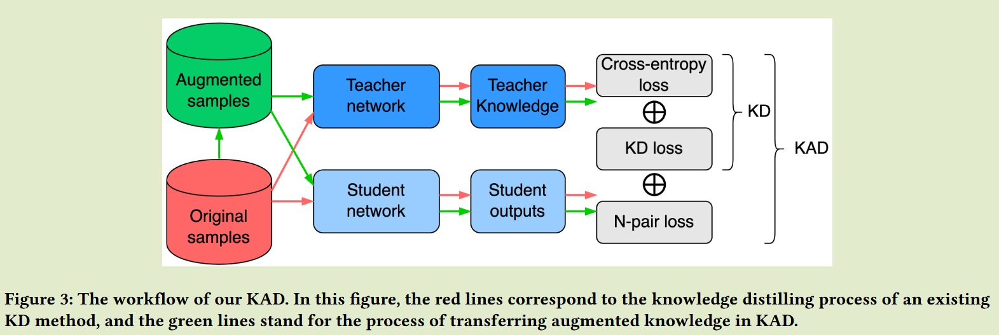
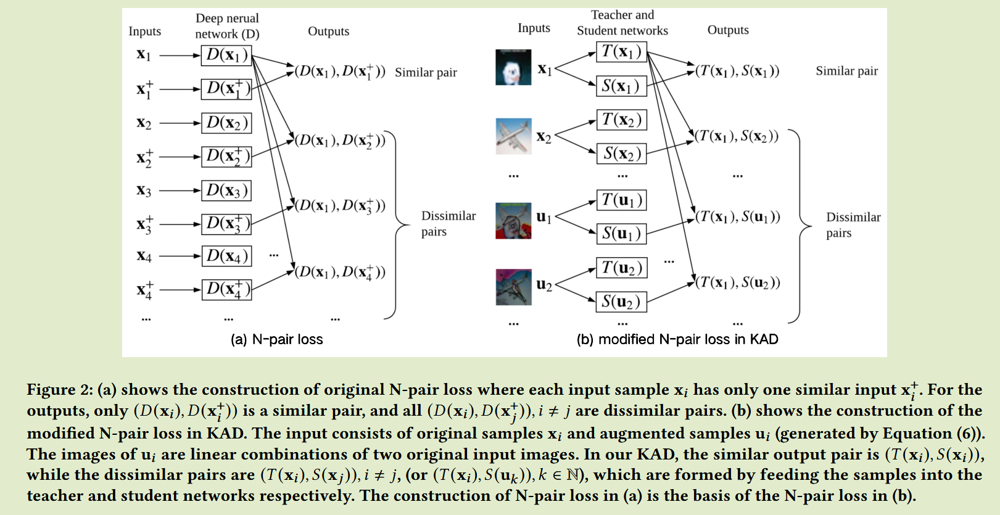

# Knowledge Augmentation for Distillation: A General and Effective Approach to Enhance Knowledge Distillation

**[2024 1st EMCLR](https://dl.acm.org/doi/abs/10.1145/3688863.3689569)	no code	CIFAR ImageNet	20241115**	知识结构

本文提出了一种知识蒸馏性能提升的新视角，先前方法都是学习现有的知识，本文提出通过生成增强样本来将教师模型的知识进一步转移到学生模型中，并且改进融合了N-pair损失，使之增大类别间的距离，减小相似对之间的输出差异。

## Introduction

现有的KD方法都侧重于从教师网络中提取各种现有的知识，该网络在原始数据集上进行训练。

我们的方法致力于通过教师网络中提取额外的增强知识来增强KD，提出一种称为知识蒸馏增强的新方法KAD，通过生成增强样本来挖掘知识并将其从教师网络转移到学生网络中。

- 我们不是从教师网络中挖掘现有的知识，而是引入生成增强样本和传输增强知识以提高KD方法的性能
- 我们设计了N对结构化的师生学习模式，进一步改进了我们的蒸馏知识增强方法，可以更好的利用增强后的知识，进一步增强KAD

## Method

我们的方法侧重于提取额外的知识，即增强知识，这些知识是教师或学生模型以前没有见过的。

在我们的KAD中，除了利用给定数据集中提取的知识外，我们还旨在生成增强样本，来从教师网络获得增强知识，而无需收集额外的数据

#### KAD的样本增强

生成增强样本的常有方式有：生成随机样本，向样本中添加噪声。但是由于以下原因，这些样本可能对学生网络的训练没有帮助：

- 教师网络仅对一定范围内的样本表现良好，而生成的样本并不在这个范围内
- 如果生成的增强样本分布与原始的数据分布完全不同，则新数据点可能会干扰学生网络的学习。

我们根据给定的数据集生成增强样本，这些样本位于给定数据集内部区域，保持这原有的数据分布，我们通过两个样本的线性组合来形成新的样本：
$$
u = \alpha x_i + (1-\alpha)x_j, \alpha\in (0, 1)
$$
通过这种方式插值获得的新数据点$\{u, T(u) \}$可以位于给定数据集的内部范围，T(u)表示教师网络的输出，当a=0.5时，增强样本与每个原样本之间的差异最大。

#### 基于增强知识的KD

我们将KAD的目标函数定义为：
$$
L_{KAD-I} = L_C(X, Y) + \lambda(L_{KD}(X) + L_{KD}(U))
$$
U表示增强样本集合，学生网络不仅可以根据数据集中给定的样本向老师学习，还能根据增强样本向老师学习来提高网络的泛化性能。

#### 通过N-pair损失增强KAD

为了充分利用增强样本并进一步提高KAD的性能，我们专注于利用隐藏在增强样本中的相似性信息，我们利用N-pair损失来增强学生网络的区分度，扩大学生网络中输出的类间距离。

我们将N-pair损失迁移到蒸馏中，如果a b为不同样本，T(a) S(a)可以视为相似样本，而T(a) S(b)视为不相似样本，我们提出一种表示法，$V=\{ X, U\} = {v_1, v_2, ..., v_i, ...}$ ，vi为输入集中的样本，对于每个vi，唯一相似的输出对为$T(v_i), S(v_i)$，其他的均为不相似对，LN损失定义为：
$$
L_N = \frac{1}{||V||}\sum^{||V||}_{i=1}log(1+\sum_{i\neq j}exp(h_{ij} - h_{ii}))
$$
其中$h_{ij} = T(v_i)^TS(v_j)$表示样本对的相似性度量，通过该损失可以减少相似对之间输出的差异。最终的总体损失表示为：
$$
L_{KAD} = L_C(X, Y) + \lambda(L_{KD}(X) + L_{KD}(U)) + vL_N
$$
其中v是Ln的超参数。