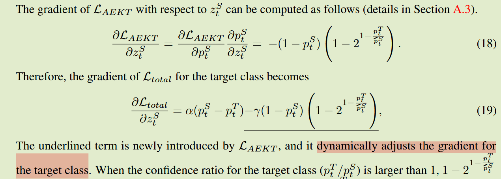

# Adaptive Explicit Knowledge Transfer for Knowledge Distillation

**[arXiv 2409](https://arxiv.org/abs/2409.01679)	no code	CIFAR ImageNet	20240915	**损失结构

*Hyungkeun Park, Jong-Seok Lee*

本文分析了经典KD与DKD的梯度，发现DKD对于损失的解耦对**非目标类中的暗知识有一个动态的自适应调整学习**，本文认为这一优势也能够**应用于目标类别**，因此进一步调整了损失来对目标类别也进行自适应的调整。本文还认为学生模型对于真实标签和教师软标签的两个优化任务，**同时学习两种不同的分布不利于优化的进行**，提出了任务序列化，先进行真实标签的交叉熵优化，然后引入一个线性层关联起目标类与非目标类之间的关系后进行蒸馏优化。

## Introduction

本文从一个新角度分析了经典KD和DKD，通过考察在训练过程中反向传播到学生模型logits的梯度，我们发现DKD包含一个额外的项，该项由教师和学生的非目标类在梯度上相对于非目标的logits的概率之比进行调整，即DKD的性能增强可以归因于对非目标logis中丰富信息（暗知识）的自适应调整学习。

基于此启发，我们提出了一种新的KD方法，称为自适应显式知识迁移AEKT，该方法能够以自适应的方式有效学习显式知识（目标类知识），设计了一个新的损失函数，可以根据教师和学生模型的置信度自适应的控制目标类别的梯度。

## Method

### 梯度分析

经典KD中反向传播的梯度由师生梯度差计算得到

DKD中：

TCKD：

NCKD:

由上述分析可以看出，对于目标类DKD的梯度与经典KD相同，区别在于对非目标类别的处理，当教师模型对目标类有较高置信度时，即$p^T_i$较小时，能够通过归一化仍然将梯度传递给学生模型，DKD允许教师的暗知识即非目标类的logit梯度根据概率值进行动态变化。

### 自适应显性知识转移( AEKT )损失

上述分析强调了动态调整梯度对于有效学习暗知识的益处，我们希望对于目标类别也能受益于这种动态调整的机制，提出了AEKT损失，该损失根据教师和学生对目标类别的置信度之比，自适应的对目标类别的学习进行加权。
$$
L_{AEKT} = log(\frac{p^T_t}{p^S_{t}})\cdot(1-2^{1-\frac{p^T_s}{\tilde{p}^s_t}})
$$
其中$\tilde{p}^s_t$表示$p^S_t$的一个常数，可以由计算图直接导出。

总体损失表示为：
$$
L_{total} = \alpha L_{TCKD} + \beta L_{NCKD} + \gamma L_{AEKD}
$$

调整后目标类也可以享受到动态调整的收益

### 任务序列化

基于logits的KD中通常是分类损失与蒸馏损失一起进行模型优化，我们认为**同时优化学生模型满足两种不同的概率分布不利于优化的进行**。

我们提出**将两个任务序列化**来解决这个问题，学生模型的logits输出后经过一个线性层后用于蒸馏任务，这个线性层只在训练是使用。

在没有fc层之前目标类与非目标类是割裂开来的，这个**线性层的好处在于关联了类与类之间的关系**。