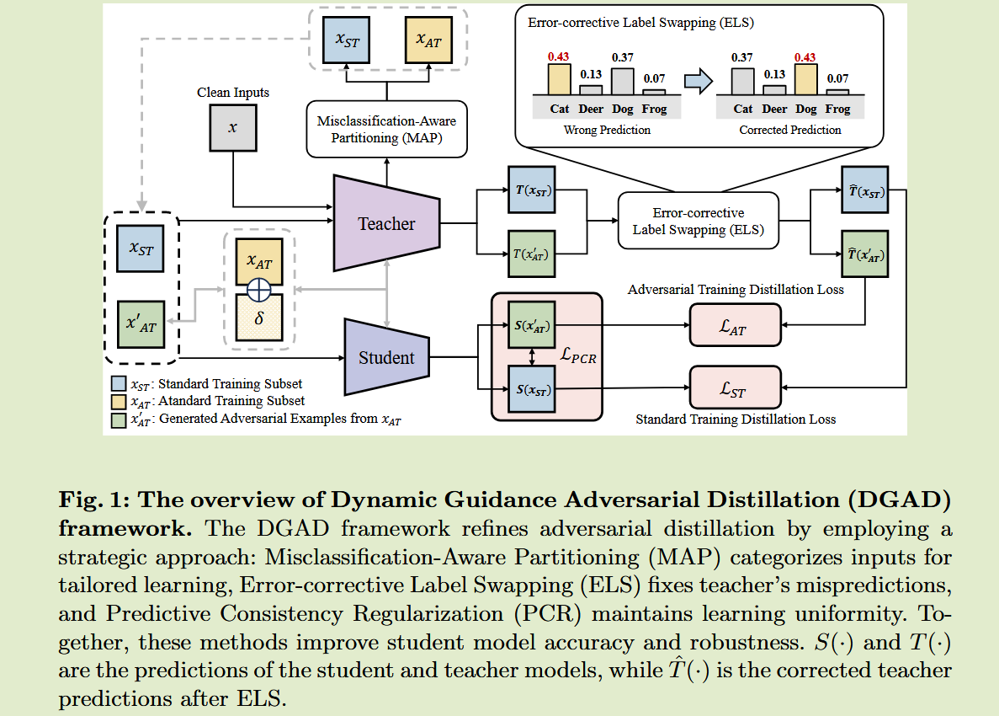

# Dynamic Guidance Adversarial Distillation with  Enhanced Teacher Knowledge

**[arXiv 2409](https://arxiv.org/abs/2409.01627)	[code in github](https://github.com/kunsaram01/DGAD)	CIFAR  TinyImageNet	20240914**

*Hyejin Park, Dongbo Min*

本文提出了一种对抗性蒸馏的框架，考虑了**教师样本的错误预测对学生模型的影响**，首先对利用教师模型**对样本进行划分**(MAP），将分错样本作为正常样本训练，未分错的样本添加扰动生成对抗性样本进行对抗性训练，并提出**错误标签交换机制**(ELS)来处理教师分错的正常样本和分错的对抗性样本，并通过**预测一致的正则化**（PCR）来缩小对抗性训练和一般训练的关系，提高学生模型的预测准确性和鲁棒性。

## Introduction

对抗训练通过对抗样本训练，已经成为增却DNN抵御对抗攻击的重要策略，但在较小的模型中由于处理对抗性扰动的能力降低而脆弱，因此对抗性蒸馏应运而生，旨在弥合对抗性条件下的性能差距。

对抗性蒸馏同样经常忽视教师预测中的不准确输出，这些错误知识会显著降低学生模型的稳健性和准确性，现有方法通过边界最大化和错分感知策略来处理这一问题，但这会显著降低模型的鲁棒性。因此有必要寻找更有效的方法来处理教师错误。

我们提出了动态蒸馏框架，通过使用动态加权来优化蒸馏焦点，主要包含三个关键干预措施来保证知识准确有效的传递给学生模型，**错误分类感知划分MAP**、**错误标签交换ELS**、**预测一致性正则化PCR**和**预测一致正则化PCR**

## Preliminaries

**对抗鲁棒性蒸馏**利用教师预测作为指导，通过正常样本和对抗性扰动样本来训练：
$$
\underset{\theta}{argmin}(1-\alpha)\cdot CE(S(x), y) + \alpha\cdot KL(S(x'), T(x)) \\
where\ x' = \underset{||\delta||_p<\epsilon}{argmax}\ CE(S_{\theta}(x+\delta), y)
$$

## Method

对抗性鲁棒蒸馏需要平衡准确性和鲁棒性之间的关系，先前方法显然是次优的，他们缺乏对样本重要性的考虑，而导致某些样本没有得到合适的加权，破坏了蒸馏的有效性。

我们提出动态蒸馏框架来动态的调整样本权重，我们**依赖于教师模型对正常样本的预测准确性来进行调整**，对于教师模型错误分类的样本，重点提高学生在干净数据上的表现。

### Misclassification-Aware Partitioning in AD  对抗蒸馏中的错误分类感知划分 MAP

动态样本加权蒸馏对有效的知识蒸馏至关重要，我们通过MAP实现这一点，将数据集划分为两个子集进行专门的训练：

- **标准训练子集**  由教师模型对正常样本x预测错误的样本组成，记为$x_{st} = \{x|argmax(T(x)) \neq y \}$，这些样本用于标准的蒸馏中，来提高对正常样本的预测准确性
- **对抗训练子集**  由教师模型分类正确的样本组成，记为$x_{AT} = \{x|argmax(T(x)) = y\}$，这些样本用于对抗训练来提高模型的鲁棒性。

这种划分允许有针对性的蒸馏，优化每个样本对学生过程的贡献：
$$
\underset{\theta}{argmin} \underbrace{KL(S_{\theta}(x_{st}) || T(x_{st}) )}_{Standard\ Training\ Distillation\ L_{ST}} + \underbrace{KL(S_{\theta}(x'_{AT}) || T(x'_{AT}))}_{Adversarial\ Training\ Distillation\ L_{AT}} \\
where\ x'_{AT} = \underset{||\delta||_p<\epsilon}{argmax}\ KL(S_{\theta}(x_{AT} + \delta) || T(x_{AT}+\delta))
$$

- 标准训练蒸馏$L_{ST}$  目标是最小化标准训练子集$x_{st}$的学生和教师模型预测之间的差异，该部分**保证学生模型在正常样本上的准确性**
- 对抗训练蒸馏$L_{AT}$  通过从教师正确识别的样本中提取对抗扰动样本$x'_{AT}$来**保证在对抗训练的情况下保持鲁棒性**

### Error-corrective Label Swapping  错分标签交换 ELS

错误标签交换是一种关键策略来纠正教师预测中的不准确之处，尤其是针对MAP后错误分类的样本。当教师模型错误的将更高置信度放到错误的标签上，则会出发ELS的纠错，具体来说：

对正常样本上所有错误预测都实施这种校正：
$$
\hat{P_T} \leftarrow SWAP(P_T(\hat{y}|x_{ST}), P_T(y|x_{ST})), \forall x\in x_{ST}
$$
对抗样本是基于使用$x_{AT}$的学生模型生成的，随着学生模型训练的进行，教师对对抗样本$x'_{AT}$的预测可能是不可靠的，为了防止这部分样本的传播，当教师预测错误时通过ELS进行校正：
$$
\hat{P}_T \leftarrow SWAP(P_T(\hat{y}|x'_{AT}), P_T(y|x'_{AT})), if\ M<0 \\
where\ M = P_T(y|x'_{AT}) - P_T(\hat{y}|x'_{AT})
$$
我们用$\hat{T}(·)$来表示校正后的教师输出：
$$
\underset{\theta}{argmin} \underbrace{KL(S_{\theta}(x_{st}) || \hat{T}(x_{st}) )}_{Standard\ Training\ Distillation\ L_{ST}} + \underbrace{KL(S_{\theta}(x'_{AT}) || \hat{T}(x'_{AT}))}_{Adversarial\ Training\ Distillation\ L_{AT}}
$$

### Predictive Consistency Regularization  预测一致性正则化  PCR

PCR解决了标准训练和对抗性训练的一致性问题。样本集合ST侧重于纠正正常样本的错误分类，AT侧重于增强对抗样本的鲁棒性，因此学生模型可能在不同环境下对相似的样本产生不一致的反应，PCR来弥补这一问题从而减轻了发散的可能性。

PCR可以看作是一种正则化方法，来协调两种样本输入的响应：
$$
L_{PCR} = ||S_{\theta}(x) - S_{\theta}(x')||_2
$$
试验发现这一正则化方法显著提升了学生模型的准确性和鲁棒性。

总体损失表示为：
$$
L_{DGAD} = L_{ST} + L_{AT} + \beta L_{PCR}
$$
