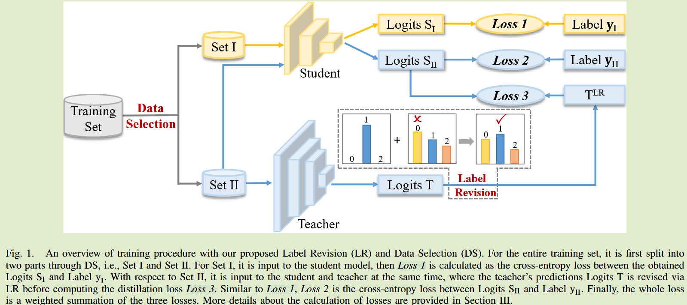
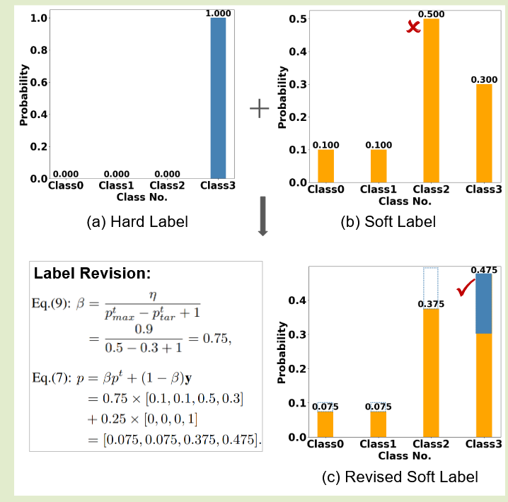
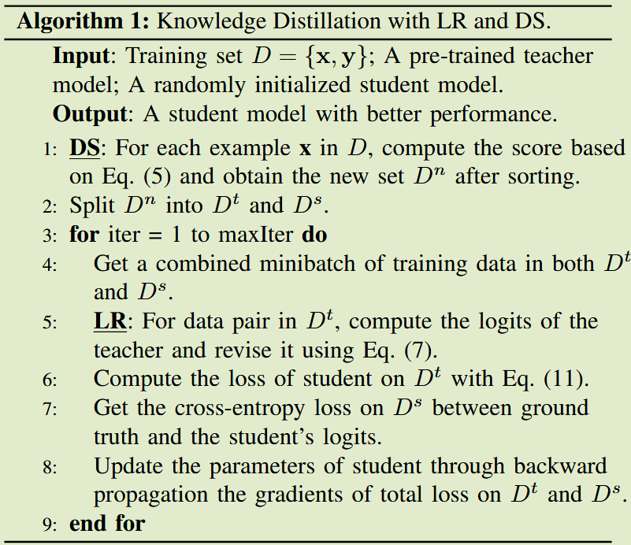

# Improve Knowledge Distillation via Label Revision  and Data Selection

[arXiv 2404](https://arxiv.org/abs/2404.03693)	no code	-	20240912	知识结构

*Weichao Lan, Yiu-ming Cheung, Qing Xu, Buhua Liu, Zhikai Hu, Mengke Li, Zhenghua Chen*

教师模型的错误预测会误导学生模型的学习，本文提出标签修正来纠正错误的教师预测，并且保持其他类别的相对关系不变，这有利于模型的泛化性；教师的监督是否有必要应用于整个训练集也是值得思考的。本文引入了数据选择技术来进一步降低错误监督的风险。通过标签修正和数据选择技术来帮助学生模型更好的学习。

## Introduction 

先前方法没有**考虑教师模型错误预测对学生模型的影响**，错误的预测会误导学生模型的训练。

我们提出**标签修正**来缓解这一问题，通过样本标签来纠正教师的预测；我们还引入**数据选择**来选择适合的数据进行蒸馏，只选取一部分样本进行教师模型的训练，其余样本直接使用真实标签进行训练

## Method

### 教师软标签矫正

尽管教师得到很好的训练，但他仍然可能会做出错误预测，从而与真实标签提供的指导相冲突而影响学生模型性能。我们提出**修改教师的软标签来提高教师监督知识的可靠性**。

我们关注教师提供的错误软标签，通过真实标签对其进行修正，假设经过softmax后的预测概率为$p^t = \sigma(z^t) = [p_1^t, p_2^t, ..., p^t_C]$，C为类别数量，则软标签计算为：
$$
p = \beta p^t + (1-\beta)y \tag{7}
$$
$p^t_{max}, p^t_{tar}$分别表示预测类和真实类的概率，为了修正错误预测，权重参数$\beta$需要满足条件：
$$
\beta \times p^t_{tar} + (1-\beta) \times 1 > \beta \times p^t_{max} + 0 \rightarrow \beta < \frac{1}{p^t_{max} - p^t_{tar} +1}
$$
增加教师输出真是类别的预测概率并削弱教师输出最大值（错误预测）的概率，令：
$$
\beta = \frac{\eta}{p^t_{max} - p^t_{tar} +1}
$$
$\eta$表示小于1的系数，这种矫正方式能够保持相似类别之间的相对概率，有利于网络的泛化性能。

针对修正后的错误预测，我们用均方误差代替KL散度：
$$
L_w = L_{MSE}(\sigma(z_w^s), p_w)
$$
校正后的标签已经包含真实标签的信息，不必在引入真实标签，其他不需要矫正的正确分类依然沿用先前交叉熵+KL散度的损失学习方式

总体损失表示为：
$$
L = L_r + \lambda_2L_w = L_{CE}(\sigma(z^s_r), y_r) + \lambda_1 L_{MSE}(z^s_r, z^t_r) + \lambda_2L_{MSE}(\sigma(z_w^s), p_w) \tag{11}
$$

### 选择合适数据进行蒸馏

从训练数据的不同角度来看，**教师的监督是否有必要应用于整个训练集也是值得思考的**。因此，我们**引入了数据选择技术来进一步降低错误监督的风险**。

引入数据影响估计算法，评估样本对模型的影响，对于高分数样本应用于教师和学生模型，而对于低分数样本仅应用于学生模型用真实标签进行训练。

