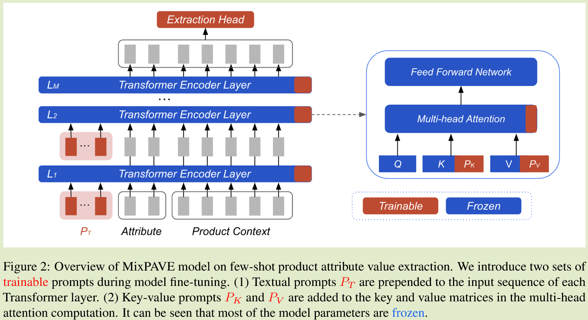

# MixPAVE: Mix-Prompt Tuning for Few-shot Product  Attribute Value Extraction

2023 ACL	20240922

2023ICCV 的另一个创新点的NLP中应用原文，为了适应新知识模型并捕获他们之间的关系而在注意力模块的KV矩阵中添加可学习的token来微调模型，最后获得更好的模型来适应不同下游任务

## Introduction

针对模型迁移到其他任务时出现的新属性，先前方法一般是通过将新属性与已有属性相融合，来重新训练模型，这种方式需要重新训练整个模型，训练开销大；另一种方式是在与新属性相关联的小数据上对模型进行充分微调，这可能会导致对新属性的过拟合问题。

受近期提示调优的启发，提出一种基于混合提示的小样本属性抽取方法，引入了两组提示token，文本token和KV键值token

## Method

- 在每个编码层输入序列插入提示文本$P_T$，来学习新属性的提取任务
- 注意力模块中的KV矩阵插入token来学习新数据的注意力模式

#### Textual Prompt

文本提示是一组与输入token具有相同维度d的向量，在训练时这部分负责新属性的提取任务，这些提示文本被定义为$P_T= \{P_T^1, P_T^2, ...,P_T^M \}, P_T^i$表示第i个编码器层上的可学习文本提示，M为总层数，编码器层表示为：
$$
Z^1 = L_1(P_T^1, A, C) \\
Z^i = L_i(P_T^i, Z^{i-1}), i = 2, 3, ..., M
$$
AC表示原网络初始化的结果

#### Key-value Prompt

文本提示有效学习了新属性的抽取任务，但是其并不能指导各个编码器内部的信息进行交互，新的数据很可能与原有的预训练模型有较大差距，因此我们需要增加一组token来捕获新的知识，提出在每个注意力块中插入KV token：
$$
L(·) = FFN(MHA(·)) \\
MHA(·) = concat(softmax(\frac{Q_jK^{'T}_j}{\sqrt{d}})V'_j)
$$
K‘ V' 表示插入token后的KV矩阵：
$$
K' = concat(K, P_K) \\
V' = concat(V, P_V)
$$

#### Extraction Head

抽取层本质是一个顺序标注模块，给每个token一个上下文标签，最终通过一个条件随机场获得输出序列：
$$
T= CRF(softmax(W_TZ^M))
$$
